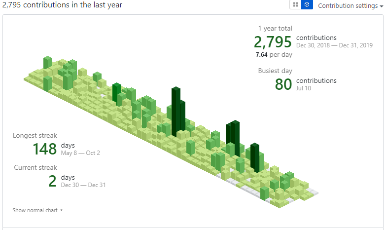
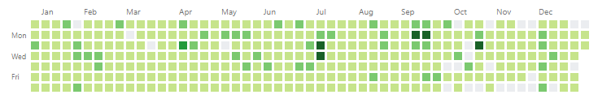
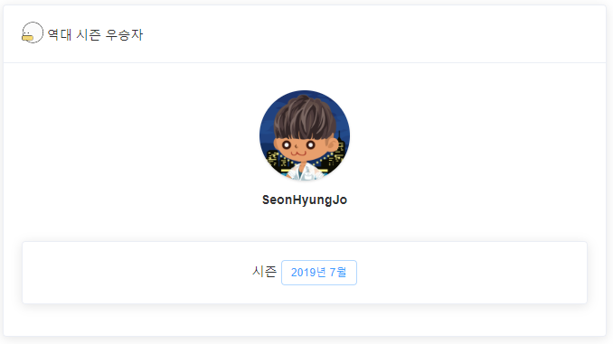
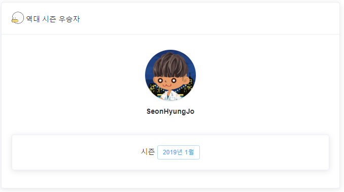
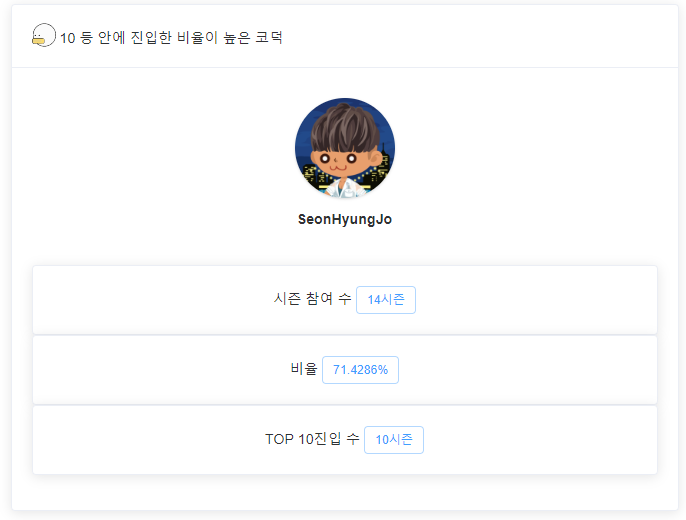
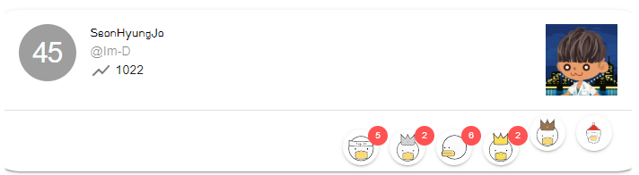
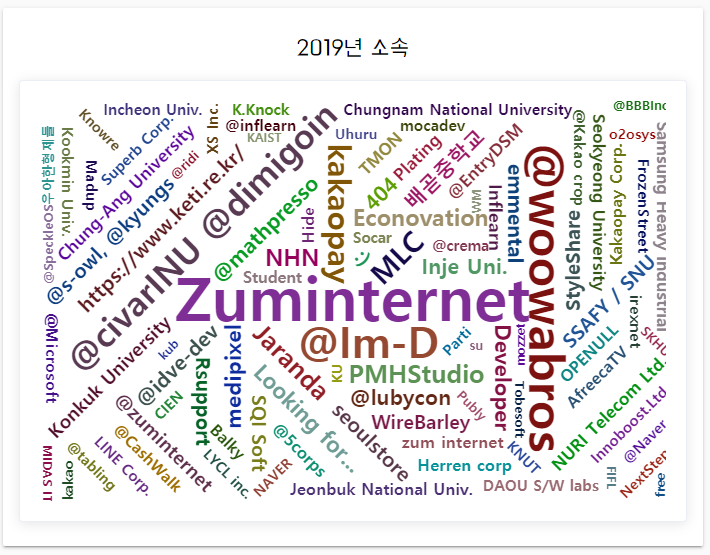

:calendar: 2019년 가고 2020년

2018년 1월에 작성한 회고록을 기준으로 올린 적이 없지만, 전에 에버노트로 적어 놓은 것을 발견했다. 다시 한번 살펴보고서 이거는 회고라 할 수 없는 Todo 리스트 같은 느낌이 많이 들어서 바로 폐기했다.

그렇게 1년이 지나고 나서 이제는 회고라 할 만한 것을 했으며, 배우고, 느끼고, 고민했기에 회고록을 작성해보았다.

2018년 취직을 해서 일을 하고 있었다. 회사내에서 개발하는 제품과 관련된 것을 알아가고 배우느라 반년이라는 시간이 흘렀고, 이외의 자기계발을 하는 데 힘을 쏟았다.

## 회사에서는

### 갑자기 Vue?

이전의 나는 제이쿼리만 할 줄 아는 사람이었다. 제이쿼리만 알던 나에게 노마드코드는 React를 알게하여 신세계를 접할 수 있도록 해주었으며, 이를 토대로 React를 즐겁게 공부를 했었다(물론 지금도 React를 정말 좋아한다.).

그때, 회사내 프로젝트를 참여하게 되었다. 프로젝트는 화면을 그리는 UI/UX 도구를 Vue로 만드는 것으로 나에게 있어서 새로운 도전이었다.

내가 참여한 지 8개월이 되고 해당 프로젝트를 마무리하고, 정식 배포를 하는 영광을 누렸다. 이게 단 2명으로 만들어졌다는 게 아직도 신기하다.

> [간단하게 체험해보기](https://snyung.com/aboutme)

프로젝트를 마무리했다는 것도 중요하지만, 이를 통해 단순히 기술스택을 늘리는 것이 아닌 내가 앞으로 무엇을 어떻게 공부해야 한다는 것 그리고 웹에 국한되었던 비전공인 나에게 길을 알게해주었다. 더 나아가 웹을 단순히 만들고 끝내는 것이 아닌 성능 개선, 프로젝트를 진행하는 데 있어서 해야 하는 것 등 많은 것을 알게 되었다.(최적화 관련 글을 정말 많이 읽었다. 특히 Google 블로그에서 최적화글)

아쉬움이 남는다면 처음부터 참여하여 진행했다면 더 많은 것을 보고 배울 수 있었을 것이라는 생각이 든다.

> 이에 나에게 많은 깨달음을 준 @leesnhyun님 고맙습니다.

### JS 개발자가 Chromium을 알기까지

프로젝트를 진행하면서 제일 재밌었던 것 중 하나는 크로미움이다. 이전에 React를 하면서 Desktop에서 돌아가게 해주는 Eletron이 있다는 것을 알았지만 Eletron이 크로미움 기반이라는 것은 개발하면서 알게 되었다. 

프로젝트상 C++기반의 크로미움을 JAVA로 바인딩한 JCEF를 빌드 및 적용하면서 재밌는 경험을 했다.

아쉬운게 있다면 아직은 불안정한 JCEF를 사용하면서 PR 했다면 더욱더 좋은 경험이었을 텐데 아쉽다.

## 내가 만든 블로그 사용하기

기존의 Jekyll 기반의 블로그를 새로 만들고 싶었다. 올 초, 리액트 정적사이트 프레임워크 Gatsby를 가지고 블로그를 만들자는 목표를 가지고 시작해서 12월이 되어서야 블로그를 완성했다.

올 초에는 능력 부족으로 구현하지 못했을 기능이나 기술을 추가하였고, 이쁘게 만들기라는 목표로 브라우저와 모바일브라우저에서 잘 보이는 블로그를 완성하였다.

아직도 만족스럽지는 못하지만, 차차 수정해가면서 발전시켜나가려고 한다.

## 나 스스로를 공부하게 해준 스터디

현재 [Im-d](https://github.com/Im-D)라고 하는 스터디를 같이 운영, 참여하고 있다. 처음 시작한 것은 작년 1월 무렵이었고, 제대로 하게 된 건 지인인 한 명의 덕이었다. 그렇게 2018년 9월에 제대로 시작하여, 한 주에 한 번씩 만나기 시작해서 Github Organization을 만들어서 같이 운영을 하면서, 지금도 활동을 하고 있다.

스터디가 있기에 한주 한주 반강제로라도 스스로 공부를 하고 다른 누군가에게 설명하기 위해서 자신을 공부시키거 같다. 이 행위 자체가 나의 성장의 원동력이 되고 피와 살이 되었다.

> 항상 우리 스터디원들에게 고맙게 생각하고 있다.

**Problem**

현재를 기준으로 1년이 넘는 시간 동안 Github을 운영하고 스터디를 참여하고 확장해가고 있지만, 이제는 스터디원을 늘리고 싶은 생각이 생기고 있다. 지금까지 진행하는 동안 미리미리 같이 스터디를 하고 싶어 하는 인원을 위해 준비하고 모집하지 못한 게 아쉽게 느껴진다.

**Try**

앞으로도 스스로를 위해서 열심히 노력하고 나아가려고 한다. 스터디를 진행하다보면 혼자서 찾아보고 공부하는 시간만이 중요한게 아니라 다른 사람이 관심가지고 공부한 내용을 내가 들었을 때 그것 또한 나에게 엄청난 공부가 된다는 것을 알기에 앞으로 새로운 사람을 많이 만나고 같이 나아가려고 노력해야겠다.

## 나도 이제 사과 사용자

### 맥북(MacBook Pro 15')

회사에서도 물론 맥북을 사용하고 있지만, 개인적으로 맥북을 가지고 싶다고 생각을 하고 매월 30만원씩 모으다 보니 어느새 맥북을 살 돈이 생겼다. 이렇게 모은 돈을 나의 생일에 나에게 선물을 해주었다.(뿌듯) 

### 에어팟 2 - 무선케이스

내가 에어팟을 쓰게 될 줄은 생각 못했다. 밑에서 적으려고 했으나 기쁜 나머지 내용이 위로 올라왔다. 😁

[FEConf2019](https://2019.feconf.kr/) 당시 뱅크샐러드(레이니스트) 부스에서 운영하던 게임 이벤트에 참여해서 1등 경품으로 주는 것이 에어팟이었다. 잘하시는 분들이 참여를 안해주신 덕분에 1등을 해서 받았다. 

> 중간에 많은 일이 있었지만 지금도 잘 쓰고 있습니다. 고맙습니다. ^^

## 소소한 만족

### Github

올해는 1일 1커밋이라는 거대한 목표로 잔디를 가꾸었다. 후반에 가면서 약간은 소홀해지는 감이 있었지만ㄴ, 목표의 90%는 달성을 하여 만족하며 내년에도 열심히 해보려고 한다.

잔디를 가꾸는데 있어서 아래의 코덕이 동기부여를 해주었다. 단순히 잔디만 가꾸는게 아니라 다른 사람들과 같이 잔디가꾸기를 하는 느낌으로 더욱 즐겁고 경쟁심을 가지고 할 수 있었다.

### Coduck

  
  
  

잔디를 가꾸는데 더더욱 흥미를 가지게 해준 코덕이다. 연말정산에서 위와 같이 언급된 것을 보면 정말 열심히 공부한 것 같아서 뿌듯하다.

2019년 12월 31일 기준으로 뱃지도 많이 늘었다.

무엇보다 나를 비롯한 스터디원들도 열심히 공부를 하고 커밋을 하여 `@Im-D`라는 소속이 중앙에 보이는 영광을 누릴 수 있게 되었다.

내년에는 조금 더 큰 글씨가 되어야겠다.

### Conference

- **FEConf**
- **JSConf2019**
- **Google I/O**

컨퍼런스는 위에서처럼 세 군데를 다녀왔다. 올해는 작년보다 두 군데를 더 돌아보고 참여하고 즐겼다. 내년에도 더욱 열심히 참여하고 꼼꼼히 보고 느끼고 적용해보는 시간을 가져야겠다는 생각을 했다.

단순히 더 많은데를 가보자라는 목표를 두고 다녔더니, 그 순간에만 즐기고 기록을 못했다. 내년에는 즐거운 뿐만 아닌 보람도 느끼는 참여를 해야겠다.

### 새로운 경험 DeepRacer

  

마지막은 DeepRacer다. ML이라는 무거운 주제를 레이싱이라는 흥미로운 게임에 적용을 한 AWS 서비스이다(잘못적었다면 댓글 남겨주세요 :pray:). 

당시 회사에서 단체로 참가할 수 있는 기회가 생겨서 4인팀에 참였다. 처음으로 ML의 방법 중 Reward를 주는 방식을 체험해보았고, Reward Function을 짜보면서 레이싱차가 가상 트랙을 도는 것을 보며 정말 재밌게 활동했다.

이후 회사단위 참여대회에서 3등을 하였다. :joy:

---

이렇게 하나하나 적어가면서 보니 올해는 정말 쉴틈없이 뛰어왔다. 많은 것을 했지만 아직은 아쉬움이 많이 남고 하고 싶은게 너무나도 많다. 

내년에는 더욱더 즐겁고 행복하게 개발합시다.