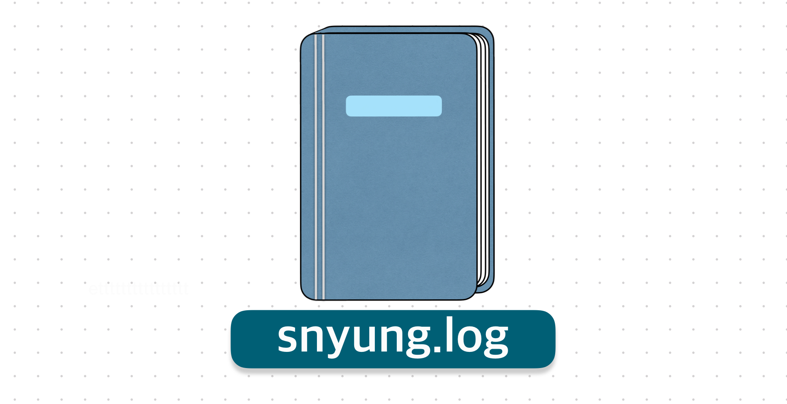
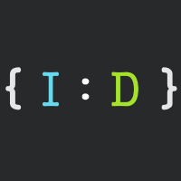
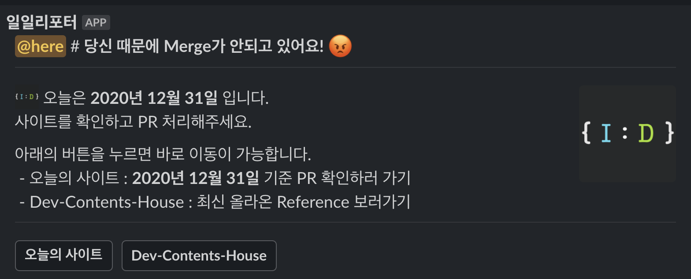

  

회고를 작성하기 위해서 한 해 동안 무엇을 했나 작성하고, 작년에 작성한 회고를 보니 올해도 내가 무엇을 하고 무엇을 느꼈나가 아닌 단순한 성과를 나열하고 좋은 모습만 보이려는 게 많이 보였다.

이렇게는 나에게 도움이 안 된다고 생각하여 작성했던 내용은 모두 지우고, 2020년에 느꼈던 것을 솔직하게 작성하려고 노력했다.

## Im-D 고도화

  

어느새 스터디가 2년이 넘었다. 시작은 처음 직장을 다니면서 3명이 모여 만들어진 간단한 스터디였는데, 어느새 구성원이 9명이 되는 규모가 있는 스터디가 되었다.

일주일에 한 번 진행하는 내용을 작성하는 Repository에는 어느새 100개 이상의 글이 만들어지다 보니 어떤 내용에 대해서 작성하고 공유해야하나 라는 고민을 많이 하게 되었다.

> [Im-D Dev-Docs](https://github.com/im-d-team/Dev-Docs)

스터디 초기에는 이것도 해보고 저것도 해보면서 내가 알게되는 것이 재밌고 스터디원들이 다 같이 모르던 시절이라 공유할 수 있는 내용이 풍부했으나 최근 공부하는 것이 이전보다 공부한게 적은 것인지 아니면 이전에는 단순한 공부로 끝나는 것인데 이제는 표현이 어려운 부분들을 알아가고 있어서인지 아직 모르겠다. 지금도 스터디원들에게 내가 작성하고 있는 또는 작성할 주제가 모두에게 맞는 내용인지 많이 고민한다.

현재 회사에서 알게된 내용이나 알아가는 내용을 공유하기 애매할 때는 스터디를 위한 공부를 했던 것 같다. 이렇게 되면 나를 위한 공부가 아닌 남을 위한 공부가 되는 것이 아닐까? 라는 생각도 들었다.

이렇게 회고 작성하며 정리하니 내가 왜 스터디에 집중할 수 없었나 라는 것이 정리되었다.

올해는 스터디를 위해서 글을 작성하기보다는 외부적인 환경을 구성하는데 노력했던거 같다.

### 블로그

우리가 가지고 있는 글들을 정리하여 공유하고 싶었고, 공유를 위한 블로그도 필요했다. 이미 작년부터 준비하고 있었으나, 실력이 부족했던 탓에 디자인적으로나 기능적으로 작업하지 못했으나 이제는 원하는대로 구성할 수 있었다.

부족한 실력에 늦었지만 12월에 배포했다. 그리고 우리만의 도메인([www.im-d.dev](https://www.im-d.dev))도 생겼다.

올해가 가기 전 블로그를 만들고 글을 올리고 싶었는데 글을 못 올린게 아쉽다. 앞으로 양질의 글을 올릴 수 있도록 노력하며 한 달에 1 Post를 목표로 작성하려고 한다.

> [Im-D 블로그](https://www.im-d.dev)

### 관리를 위한 사이트

  

올라온 글들이 Review 되는 시간이 장기화되어 Merge 되는데 2달 이상 걸리는 일도 생겼다.

누구나 볼 수 있고 누가 안 하고 있는지와 PR들이 어떤 단계에 있는지 리포트 해주는 것이 필요하다고 생각했다. 이전에도 비슷한 기능을 하는 도구가 있었으나 Noti 도구는 너무 자주 알림이 오다보니 Noise가 발생해 구성원들이 모두 알림을 꺼서 아무 소용없는 것으로 전락했다.

이번에는 전략을 바꿔서 하루하루 결괏값을 저장하여 웹으로 보여주는 페이지를 만들었다. 만들고 나니 PC나 Mobile로 접근하여 보기도 좋고 누가 안 하고 있는지 쉽게 볼 수 있었다. 또한 다음에 새로운 기능을 넣기에도 좋다는 장점을 가지고 갈 수 있었다.

이렇게 만들어서 관리하니 모두에게 보여 서로 확인할 수 있으면서 까먹고 있던 날에는 다시 리마인드 할 수 있었다. 다시 한번 관리도구의 중요성을 느꼈다.

## 나도 이제 웹 개발자

이직했다. 2019 회고에 나오는 회사로 생각보다 많은 것을 배우고 알게 되었다. 참 고마운 경험을 주었지만, 항상 부족했다. 이직의 계기였다. 웹을 하고 싶었다. 알고 있거나 관심 있어 했던 모든 기업에 지원하고 쓴맛도 보고 기분 좋은 경험도 많이 했다.

이직하지 않아도 항상 주기적으로 면접을 보라고 했던 글이 생각났다. 면접은 나에게 좋은 경험과 부족한 것을 알게 해주는 좋은 방법이었고 덕분에 아직도 많이 부족하고 알아야 할 게 많다는 걸 알게 되었다.

결국 **콜버스**에 합격할 수 있었다.

### 프론트엔드 개발자

이직하고 싶었던 이유에는 다른 프론트엔드 개발자분들이 있기를 원했다. 혼자서 하는 공부는 자만심에 빠지게 하고 나를 갇힌 공부로 이끈다고 생각한다. 지금도 그 생각을 하고 있다.

그래서 같은 분야의 개발자분들이 있다면 같이 이야기를 하면서 힘든 것에 논의하고 해결방법도 고민할 수 있다는 것이 필요하다고 했다. 그리고 콜버스에 오고 나서야 그 기분을 느낄 수 있었고 재밌었다.

### 힘든 이별

코로나로 인해서 사용자가 점점 줄어들게 되고 회사가 어려워졌다. 여느 회사들이 힘들 듯이 우리도 힘들었다. 결국 많은, 개발자분들과 이별을 하게 되었다. 나의 목표인 개발자들과의 토론과 논의는 더는 못하게 되었다. 그래도 가신 분들과 스터디를 만들고 잘 지내고 있다는 것이 나에게 좋은 기회와 행복이 되었다.

다시 좋은 분들이 오시기를 기다리고 있다. 이 코로나는 제발 좀 사라져라.

### 내가 팀장?

많은 좋은 분들을 만났지만 제일 아쉬운 건 팀장의 부재이다. 기존 팀장이 나가게 되면서 공석이 되었다. 팀장 제안이 왔고 받아들였다.

솔직히 받아들이고 나서보니 너무 빠르게 받아들인 게 아닌가라고 생각했다. 그런데 제안을 들었을 때 이미 머릿속으로는 어린 나이에 팀장이라는 직책은 좋은 경험이 될 것이라는 확신이 있었다. 또한 나중에는 CTO가 되고 싶다는 목표를 이루는 데 좋은 발판이 될 수 있다고 생각했다.

팀장직을 맡고 한 달이 지난 지금 시점에서 아직도 이전 팀장이 생각난다. 많은 조언을 들었고 어떻게 생각하고 행동하는지를 알려주었다. 지금도 그분이 했던 행동을 다시 떠올리며 왜 그렇게 말을 해주고 행동했는지 알아가고 있다. 내년에는 나 스스로 생각하고 판단하는 것이 많아져야겠다.

이 시기에 책을 열심히 읽었다. 인간관계론이었다. 팀장이라는 직책은 개발로도 많이 알고 판단할 수 있는 능력을 갖추는 것은 기본이라고 생각했고, 이전부터 많은 팀장분을 보면서 내가 하고 싶었던 것은 거리낌 없이 커피를 같이 마시며 수다떨 수 있는 사람이 되기를 원했다. 그리고 이미 시행하고 있다.

나를 팀장으로 둔 분들이 힘드시고 답답하실 거로 생각하고 있다. 항상 고맙게 생각하고 **하루하루 자기 전 어떻게 해야 했었나** 다시 생각하고 있다. 앞으로는 더욱 발전한 모습을 보여드리고 싶다.

## 새로운 마음, 새로운 기술

항상 새로운 기술을 배우려고 노력하고 적용해보고 싶다는 생각한다. 그러나 실제로 공부하고 있지만 적용할 기회는 많지 않다 오히려 새로운 프로젝트에 내가 맞추기 위해서 공부하는 게 많았다.

새로운 프로젝트를 할 수 있는 기회가 생겨 이전과 다르게 프로젝트에 내 기술을 맞추는 것이 아니라 알고 있는 기술을 적용한 프로젝트를 했다.

### 새로운 기회

  

새로운 프로젝트는 정말 내 것이라는 생각을 많이들게 한다. 회사에 입사를 하거나 이직하게 되면 대개 새로운 프로젝트보다는 이미 있는 프로젝트에 유지보수를 하기 마련이다. 유지보수를 한다 하더라도 내 것이라는 느낌보다는 이 회사의 것이라는 느낌을 주게 되고 스스로 열심히 하려는 노력을 하지 않게 되었다.

새로운 프로젝트는 내가 구성하고 내가 원하는 스펙과 구조를 가져가니 내 프로젝트 같으면서 실제로 사용자가 있으니 신기하면서 재밌었다. 앞으로 잘되어 개발자분들이 더 오고 **재밌게** 개발할 수 있는 환경이 되었으면 좋겠다.

### 새로운 기술

> Preact + Vite + TS + SWR

회사에서 모든 프로젝트가 Vue로 구성되어 있다 보니 React를 사용할 기회가 없었다고 한다. 또한 유지보수를 위해서 Vue로만 관리하고 있었다.

팀장이 되고 하고 싶었던 것 중 하나는 새로운 프로젝트는 React를 사용하고 싶다는 것이었다. Vue도 좋은 프레임워크이지만 React보다 자료가 적다는 것과 버전 업데이트가 늦는 것이 아쉬웠다.

비록 React는 아니지만 Preact로 진행했다. 자세한 기술 정보는 검색해보는 것을 추천한다. **각각의 장점이 뛰어나 빠른 개발과 높은 퍼포먼스를 경험**할 수 있다.

Preact는 자료가 없다고 생각할지 모른다. 나도 React 라이브러리를 fork해서 Preact로 변경 후 사용하고 있다. 그 과정 또한 공부되고 좋았다. 혹시 Preact를 쓰시는 분들은 같이 공유할 수 있었으면 해서 Repo를 만들었다. 같이 공부하며 발전해 갔으면 좋겠다.

> [Preact Vite 공유 레포](https://github.com/SeonHyungJo/preact-vite__discussions)

## 내년에는

올해 책을 많이 읽고 싶었는데 12월이 돼서야 여유가 나서 많이 읽었던 거 같다. 한 달에 4권을 몰아쳐서 읽었다.

책을 더 많이 읽어보고 싶었다. 내가 읽으려는 책은 개발 책보다는 개발 이외의 책이다. 개발자라고 생각해서 맨날 개발 서적을 읽어야한다는 생각을 하고 있었는데 이제는 그 생각이 바뀌어서 나의 성장을 위한 책을 찾으려고 노력하고 있다.

올해 이직하고 다른 개발자분들과 이야기도 많이 했지만, 다른 분야(운영, 마케팅)에 분들과 이야기하면서 많은 생각을 하고 고민할 수 있었다. 단순히 개발만 생각해서 내 스킬을 늘리는 것보다는 다른 모든 것들을 고려하려면서 개발하려고 노력했고 더불어 인간관계에 대해서 고민하게 되었다.

내년에는 발전된 나를 볼 수 있으면 좋겠다.
