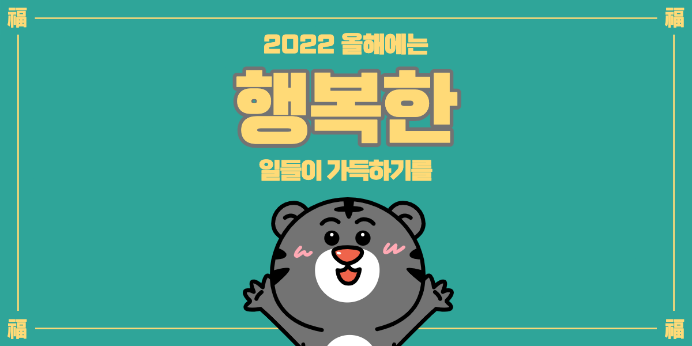
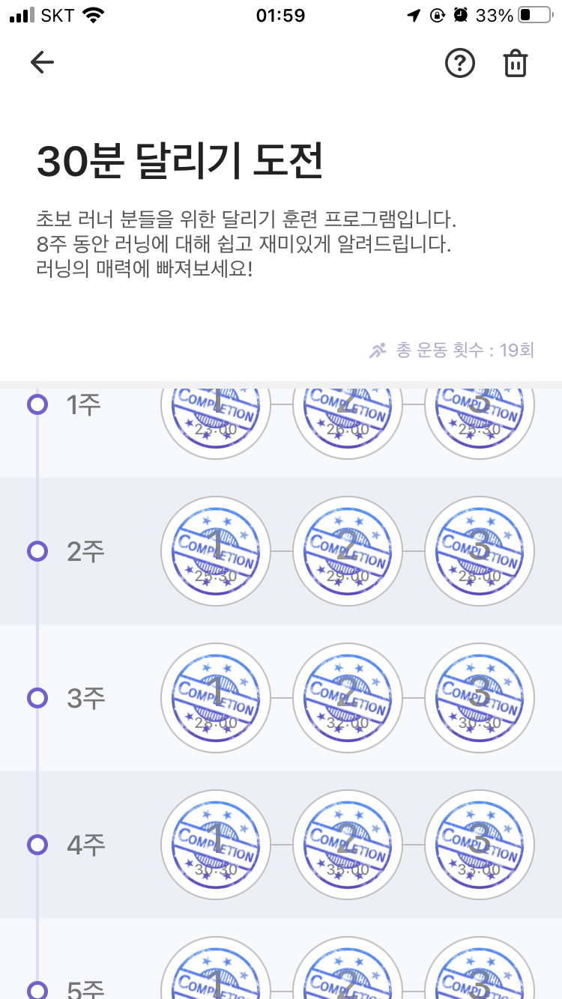
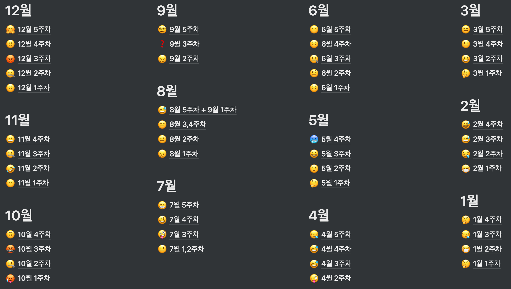
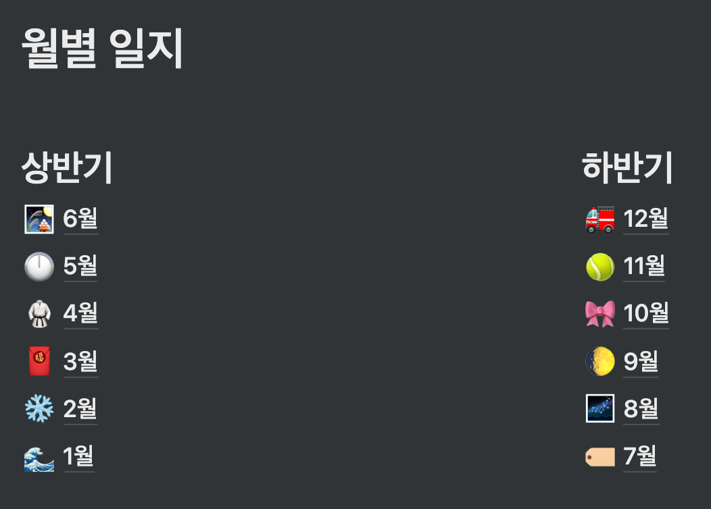
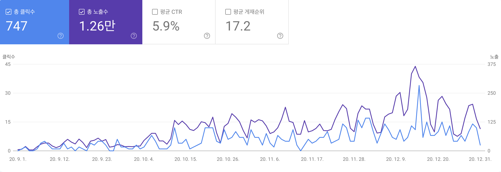
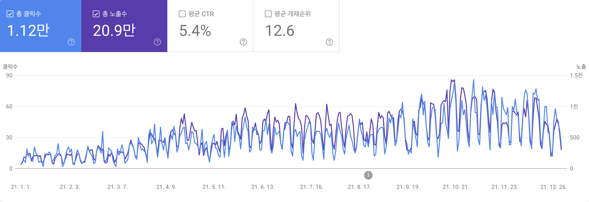

  

## Intro(생각해보기)

이번 회고는 작성하지 않으려고 했다. 생각해보면 회사에서 새로운 제품(자리톡)을 만들고 운영한 밖에 생각나지 않았고, 이걸 쓴다고 해서 의미있는 글을 작성할 수 있을까? 라고 생각했다.

최근 일은 어떻게 해야 하는 것이고 어떻게 일을 하는 게 맞는 것인지에 관한 생각을 많이 하게 되었다. 일이 나의 생활을 잡아먹고, 나의 생활을 하기 위해 일을 이렇게까지 해야 하나 라는 생각을 한 것이다. 나의 생활을 하는게 더욱 노력해야 한다는 게 말이 되나? 내 시간인데?

그래도 막상 연말/연초에 다른 분들이 올린 글을 보니 회고라는 게 단순히 내가 했던 걸 나열하는 게 아니라 내 생각을 적는 것이었다는 것을 다시 떠올리게 되었다. 그러면 내가 가지고 있는 생각을 다시 정리하는 것이 목적이라는 생각이 들었다.

회고라는 좋은 말이 있지만, 내 생각을 곱씹으면서 잘못한 생각과 더 발전시키면 좋을 거 같아 제목을 **곱씹어보기**라고 하였다.

### 2021 회고 돌아보기

- 00으로서 나는
- Im-D 고도화 & 블로그

2021년이 되면서 내가 제일 중요시 했던 생각은 개발자로서 개발을 당연히 공부하고 Develop 해 가는 건 좋은데 내가 하고 싶은 일을 하는 게 목표였다. 그렇게 생각하니 올해는 완벽히 이루지 못했지만, 꽤 이루었다고 생각했다.

올해 제일 아쉬운 것은 운영하던 Im-D 스터디를 그만하기로 했다. 2021년 10월부로 모든 활동은 중지하고 Slack 채널만 유지하기로 했다. 어느 순간 스터디원들의 열정이 이전과 동일하지 않은 것을 인지하고 있었고, 3년간의 스터디를 2021년 부로 마무리 지었다.

## 목차

- [Intro(생각해보기)](#Intro(생각해보기))
- [자리톡](#자리톡)
- [활동](#활동)
- [Next Level](#next-level)

## 자리톡

자리톡이란 무슨 서비스인가? **임대인이 사용하는 서비스로 임차인 관리, 수납관리, 공실 내놓기, 임대인 커뮤니티를 가지고 있는 종합 서비스**다.

> [zaritalk.com](https://zaritalk.com)

### Service

첫 내용으로 회사의 내용을 안 적을 수 없었다. 올해는 회사 일에 집중한 게 80% 였다고 생각했다. 작년 회고글을 보게 되면, 이름은 적지 않고 새로운 서비스를 런칭했다고 작성하였다. 이제는 소개해도 된다고 생각이 되어서 작성해보려고 한다(물론 개발자들에게 알리고 싶어서다).

서비스 런칭은 작년 크리스마스이브(2021.12.24)에 해서 1년이 넘었다. 생각보다 많은 임대인 분들이 자리톡 서비스를 보시고 필요한 서비스였는데 만들어 줘서 고맙다고 해주셨다. 현재도 가입자 수는 꾸준히 늘고 있고, MAU(Monthly Activity User)도 점점 늘어나고 있다. 그러다 보니 개발자 대비 일도 많이 늘어나는 추세다.

초기에 2명의 개발자(본인 포함)가 한 달도 안 되는 시간 동안 만들어서 배포하였고, 작은 서비스로 시작해서 벌써 굵직한 Feature를 3개나 가진 서비스가 되었다.

처음으로 서비스를 초기부터 만들어서 운영해보았다. 누가 연차도 별로 안 되는데 이러한 경험을 할 수 있을까? 라고 생각했다. 시간이 지나더라도 경험은 돈주고 살 수 없으니까.

### Prev Skill

초기 서비스는 **Preact + Vite + TS + SWR** 였다. 이렇게 구성한 이유는 Preact라는 새로운 라이브러리를 사용하면서 Vite로 빠른 개발 & 빌드할 수 있게 하고, TS로 좀 더 안정성이 높은 서비스를 만들고 SWR로 컴포넌트 단위로 개발을 유용하게 하고 싶은 마음이 모두 담겨있었다.

### New Skill

개발을 진행하다보니 문제가 있었다. Preact로 개발을 하다보니 라이브러리들이 React는 지원하나 Preact를 지원하지 않아서 사용하고 싶은 라이브러리가 있을 때마다 Preact로 바꾸는 작업을 하고 적용하여 2번 작업하였다. 

사실 이런 일이 일어날 수 있을 것을 미리 생각하고 작업하고 있어서 이전하는 과정은 쉬었다. 우선 React로 변경하는 걸 1차 목표로 잡았으며 Next js로 바꾸는 것을 2차 목표로 잡았다. 그리고 올해 마지막 목표를 Nx Framework로 전환하는 것이었다. 

> 💡 Nx는 마이크로 프론트엔드를 위한 Framework로 다양한 App을 개발한다면 유용하다.

자리톡에서는 현재를 기준으로 임대인을 위한 App, 중개인을 위한 App, 어드민 App 이렇게 구성되어있다. 그리고 각각의 App에는 다양한 Domain들이 들어가 있다. 각각의 Domain은 동일한 컴포넌트, Hooks, Util, API(SWR)를 사용한다. 이를 서로 별도의 프로젝트로 구성하게 되면 동일한 기능의 코드가 여러 곳에 있게 된다. NPM으로 올려서 관리한다면 배포하는 시간과 확인하는 시간이 걸리게 된다. 이를 더욱 쉽게 유연하게 관리하기 위해서 Nx를 도입한 것이다.

초기 SCSS로 개발되었으나 관리가 힘들다는 결론이 나왔다. 스타트업 특성상 만들었다가 사라지는 컴포넌트가 많은데 SCSS로 관리하게 되면 사용되었다가 사라지는 스타일이 많아 관리하기 힘들며 동일한 클래스가 너무나 많아지고 있다. 이후에 찾아보니 Zero-Runtime Styled Component인 Stitches를 알게 되고 나서 SCSS를 다 Stitches로 변경하였다.

PC보다는 Mobile이 편하고 사용하는 시간이 많다보니 웹보다는 앱이 편하다는 사람들이 많다. 그리고 생각보다 많은 분이 앱 스토어(플레이 스토어)에서 검색하고 들어오는 경우도 상당했다. 앱에 필요성으로 인해 안드로이드 개발자, IOS 개발자를 모두 뽑을 수 없어 이번 기회에 공부하고 적용해보았다.

결과는 생각보다 좋았다. 하이브리드 웹앱으로 개발하여 화면을 다시 만들지 않고 앱배포가 아닌 웹배포로 빠르게 대응할 수 있도록 하였다. 이번 개발은 혼자서 한 달간 공부하고 개발하였다. Post를 작성하기도 했지만, React-Native로 개발하였으며 fastlane으로 자동화하고 firebase를 적극적으로 활용하였다.

올해는 나와 개발할 분들이 많이 들어왔으면 좋겠다.

[https://www.wanted.co.kr/company/2157](https://www.wanted.co.kr/company/2157)

### 새로운 프론트엔드 개발자

2021년 중반까지는 프론트엔드를 혼자서 담당하고 있었다. 시간이 갈수록 할 일은 많아져만 가는데 혼자서 감당할 수 없는 경지가 왔다. 그래서 새로운 분을 채용하였다.

사실 경력자인가, 신입인가를 많이 고민했다. 그런데 신입을 뽑는 것에 주저함이 없었다. 이전에 스터디에서 많은 사람과 같이 공부하는 것에 익숙해지다 보니 내가 가지고 있는 지식을 공유하면서 **같이** 성장할 수 있다는 자신감이 있었다. 그리고 그 결과는 매우 만족스럽다.

### Code Review

입사 당시 콜버스랩에서는 코드리뷰 문화가 없었다. 그렇다보니 개발자끼리 어떤 코드를 작성하고 개발되고 있는지 공유할 시간, 배울만한 시간이 없었다. 팀장이되고 2021년에 처음으로 도입하여 점차적으로 맞춰나가는 방향으로 진행하였다.

생각해보면 개발을 빠르게 하는 건 중요하지만 그보다 중요한 건 안전하면서 클린한 코드가 되도록 유지하는 것이다. 그리고 개발자들이 자신의 코드를 통해 의견을 공유할 수 있는 환경이 있어야 한다고 생각한다. 개발자의 발전은 공유로부터 오니까. 콜버스랩에 처음 들어왔을 때 코드리뷰도 다 시간이 있어야 한다고 생각했으나 꼭 그렇지 않았다. 내가 출근하고 1시간만 시간을 내어도 리뷰는 충분히 할 수 있다.

내 채용의 기준은 나에게 도움이 되어주는 사람이다. 리뷰할 때 나에게 ‘이거 이렇게 하는건 어떻게 생각하시나요?’ 라고 말을 해주는 사람이 필요하다. 그냥 승인을 할 거면 내가 그 사람을 채용할 이유는 없다고 생각한다.

### Study

새로운 개발자분이 오시면 하고 싶었다. 최근 신입 개발자분들 중 자바스크립트 코어를 잘 모르고 개발하시는 분들이 많다고 생각한다. 그래서 새로 오신 분과는 우선 그 개념을 잡고 시작하고 싶었다. 약 한 달간 같이 코어자바스크립트 책을 보면서 개념을 잡았고, 이후에는 클린코드로 코드를 어떻게 작성하여야 좋은가는 논의하고, 마지막으로 리팩토링2를 보면서 어떻게 코드를 클린하고 리팩토링 할 수 있는지 논의해 보려고 하고 있다.

그중 현재 2단계를 무난히 진행하고 있다. 이외에 네트워크에 대한 책을 보면서 같이 공부도 생각하고 있다.

### 이별한 서버 개발자

제일 슬픈 날이다. 자리톡을 초기부터 같이 개발하신 분이 퇴사한다고 하셨다. 예상한 일이면서도 매우 가슴이 아픈 일이었다. 같이 호흡을 맞춘 분이 떠나간다는 건 회사적으로도 손실이지만 개인적으로 큰 아픔으로 다가왔다.

그분이 단순히 일적으로 좋았다라고 생각하기엔 그보다 더한게 많았다. 초기에 야근하면서 개발하고 저녁도 같이 먹으면서 아주 친해졌고 회사에서 대화를 제일 많이 하고 서로의 의견을 받으면서 나도 많이 배웠다. 처음으로 회사분이 퇴사한다는 말이 슬픈 단어라는 걸 알게 되었다.

**좋은 곳에서 항상 행복한 일만 가득하시길**

## 활동

퇴근하고 해보고 싶은 것들을 하는 시간을 조금씩 가졌다. 그렇다고 내가 활동적인 성격이 아니라서 모임에 참여하고 사람이 많은 곳을 가는 것은 못하지만 하고 싶었던 것을 하나씩 해보려고 했다.

### Running

  

운동을 하고 싶어하던 시기였는데 회사분들이 러닝에 관심을 가지게 되면서 자연스럽게 나도 러닝을 해볼까? 하는 생각이 들었다. 10월 한 달간 RunDay라는 앱을 깔고 초보러너를 위한 러닝 프로그램을 시작했다. **총 19회** 정도 달렸고 슬슬 재미를 느껴가고 있었다. 

11월이 되고 날씨가 추워지니 자연스럽게 달리는 날이 줄어들더니 지금은 달리고 있지 않다. 올해는 덜 추워지기 시작하면 러닝을 시작해서 이전보다 더 달려보고 싶다.

러닝은 무릎을 쉽게 다칠거라고 생각했는데 유튜브로 공부하고 앱에서 설명해주는대로 달리니 안전하고 재밌게 달릴 수 있었다.

### Piano

이전 회사분을 만났는데 악기 배우고 싶다고 생각이 같았다. 6월에 급격하게 학원을 찾아보고 강남역에 있는 학원을 3개월 수강권으로 시작했다(현재 6개월째 수강중).

지인을 만나 피아노 학원에 다닌다고 하면 다들 말을 맞춘 듯 ‘체르니 몇까지 했어?’라고 물어본다. 한국 사람의 특징인 줄 알았다. 성인이 체르니를 하나씩 한다고 흥미를 느끼는 것도 아닌데 학원이 돈을 벌기 위해서는 성인이 흥미를 느끼는 수업을 하지 않았을까? 현재 피아노 학원은 본인이 원하는 곡이 있다면 그 곡을 칠 수 있게 도와주게 한다.

그런데 나처럼 도레미도 못치는 사람은 이론부터 해서 읽는 법, 치는 법을, 한 3~4주간(일주일에 1번 개인지도) 배우고 그 뒤부터 노래라는 걸 연주할 수 있게 된다. 이제는 악보를 보고 칠 수 있게 되었다. **올해도 계속 다닐 거 같다**. 피아노를 잘 치는 건 날이 갈수록 재밌으니까!!

## ReadMe

집, 회사 등 어디에서든 기록하는건 나에게 자산이 된다고 생각하고 있다. 이전에도 기록은 많이 하고 있었지만 올해 회고에서 처음으로 정리한 내용을 토대로 곱씹어보려고 한다.

### CallbusLab

  

회사에서는 Jira, Notion 등등 회사에서 사용하는 Tool이 있다. 그러나 개인적으로 회사 일을 정리하면서 기록하는 것을 좋아하기 때문에 2018년부터 Notion을 사용하기 시작해서 주 단위로 내가 할 일과 한 일을 정리하고 있었다. 그 결과 올해 1년 동안 기록이 남게 되었다. 

주 단위로 기록하게 되면 좋다. 2018년 처음 사용할 때는 하루하루 단위로 기록했으나 기록을 확인하고 파일을 관리하기가 힘들고 스프린트의 개념에서 보면 주단위가 작성하기 좋았다. 추가적으로 한 주에 한 내용에 대해서 스스로 이모지로 기분을 표기하면서 내가 얼마나 힘들고, 재밌었는지 한눈에 볼 수 있었다.

연말에 이 기록들을 펼쳐서 보니 뿌듯하면서 스스로 고생을 많이 했다고 생각하게 되었다. 한주는 별거 아닌듯 써내려가는데 1년이라는 큰 단위가 됨으로써 나에게 큰 의미로 다가왔다.

### Personal Schedule

  

회사에 대해서는 회사대로 정리하고 개인적인 스케줄이나 목표는 따로 정리하고 있었다. 개인적인 스케줄은 일이 아닌 내가 생각하거나하고 싶은 것을 저장하는 공간이다.

주가 아니라 월별로 작성하고 있다. 개인활동하는 것은 주마다 작성한다고 해서 많은 일이 일어난다고 생각하지 않았다. 당연한 것이 아침에 일어나서 10시 반에 출근을 하고 7시 반에 퇴근해서 집에 도착하면 거의 9시가 되어 2시에 잠들게 되면, 집에 있는 시간은 4~5시간이지만 회사에서는 8~9시간을 보내기 때문이다.

4~20일간 적지 않은 날이 있지만 이건 간헐적 일기처럼 며칠간 해야 할 목표를 정하고 작성하는 공간이라고 생각했기 때문이다.

### Blog

실패했다 😥 한 달에 1 Post를 목표로 생각했는데 올해는 9개밖에 작성하지 못했다. 지금도 쓰고 싶은 내용은 차고 넘치는데, 막상 글을 쓰려고 하면 다른 것들의 유혹을 피하지 못하고 글을 쓰지 않게 되고 있다. 그래도 9개밖에 작성하지 않았지만 많은 분의 관심사가 같아서인지 들어오시는 분들이 많이 늘었다.

2020년 9월에 블로그를 시작했다. 올해 2년 가까이 되는 시점에서 연도별로 비교를 해보았다.

  

> 2020년 9월~12월

  

> 2021년 1월~12월

정확히 1년을 비교하는 지표는 아니지만 클릭 수, 노출 수, 게재 순위에 많은 변화가 있다는 것을 확인할 수 있었다. 아쉬운 건 최근에 글을 작성하지 않았더니 점점 하락세에 접어들었다.

다시 한 달에 1 Post 하려고 한다.

## Next Level

올해에 대해서 다시 곱씹어보면서 적어보니 생각보다 많은 것을 하려고 했고, 100% 완벽하게는 아니지만, 행복하게 살아왔다고 생각했다. 작년보다 적을 게 많아서 좋았다 😁

회고의 핵심은 작년을 되돌아보며, 앞으로 어떻게 나아갈지를 생각해볼 수 있는 시간을 스스로 가진다가 핵심이라고 생각해서 마지막은 올해 목표를 작성하였다.

올해는 행복한 한 해되기

### Tech

- Rust
- React-Native
- Micto-FrontEnd
- Test Code

### None Tech

- 돈 공부(주식, 부동산, 블로그)
- 취미 추가(피아노, 여행 다니기)
- 건강챙기기(러닝, 영양제, 피부)
- 운전하며 돌아다니기
- 책 10권 읽기
