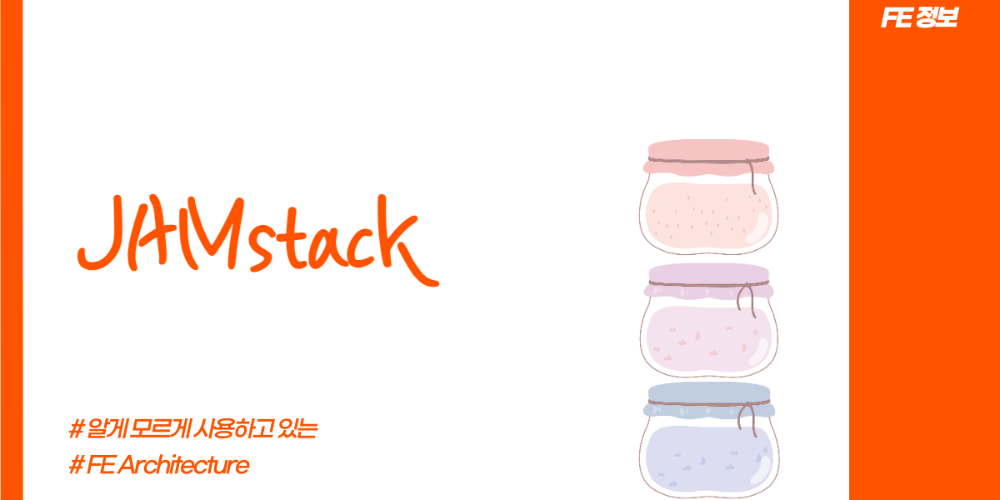

## Intro

이전에 들어봤던 단어였으나 제대로 찾아보는 것은 처음이다. [SWR](https://swr.vercel.app/)를 공부하면서 다시 찾아보게 되었고, 다시 까먹지 않기 위해서 정리를 해보았다.

[공식 사이트](https://jamstack.org)에서는 아래와 같이 정의하고 있다.

> Jamstack is an architecture designed to make the web faster, more secure, and easier to scale. It builds on many of the tools and workflows which developers love, and which bring maximum productivity.

JAMstack는 웹을 **더 빠르고, 더 안전하고, 더 쉽게 확장**할 수 있도록 설계된 아키텍처이다. 개발자가 좋아하며, 생산성 높일 수 있는 많은 도구와 workflow 제공할 수 있다고 한다.

## JAMstack

JAMstack은 아래와 같은 3가지 의미를 담고 있다.

- `J` : JavaScript(동적기능)
- `A` : APIs(서버작업 대신 재사용 가능한)
- `M` : Markup(HTML, CSS 같은 정적 자원)

HTML, CSS, JS을 사용하여 웹애플리케이션을 구성하는 스택이다. 최종적으로 이러한 자원들을 CDN(Content Delivery Network)에 배포하여 서버의 관리를 최소화하는 것을 목표로 한다.

DB, Server는 철저하게 API로 분리하여 정적인 사이트 만드는데 최적화되어있다.

## Benefit

JAMstack 공식 사이트에서 말하는 stack의 장점은 6가지가 있다.

### Security

JAMstack에서는 호스팅 인프라 공격의 취약성에 대응해야 하는 서버와 시스템을 줄여 호스팅 업체에서는 특정 시스템을 보호하고 높은 수준의 서비스를 제공하는 것에 집중할 수 있다.

### Scale

가장 좋은 아키텍처는 인기 있는 view와 resource를 caching 하는 로직을 추가해 과도한 트래픽을 처리하는 것이다.

JAMstack에서는 이를 기본제공하여 사이트는 어떤 resource를 언제 caching 할지 결정하는 복잡한 logic과 workflow를 제거했다.

JAMstack을 사용하면 CDN에 모든 것을 caching하며, 간단한 배포, 높은 load capacity를 누릴 수 있다.

### Performace

페이지 로딩 속도는 사용자 경험과 전환에 영향을 미친다.

빌드 중 페이지를 미리 생성하여 요청 시 서버에서 페이지 view를 생성할 필요 없이, 모든 페이지가 사용자와 가까운 CDN에서 이미 만들어진 페이지를 제공해 비용이 적고, 복잡한 인프라를 사용하지 않아도 높은 성능이 가능하다.

### Maintainability

호스팅 복잡성이 줄어들면, 유지보수도 적어진다. JAMstack에서는 호스팅하고 유지하는데 전문가가 필요없게 된다. 모든 작업은 빌드 중 완료되며, 업데이트 및 유지 관리 서버없이 호스팅할 수 있다.

### Portability

JAMstack은 미리 만든다. 다양한 호스팅 서비스에서 호스팅 가능하며, 호스팅 업체 간 이동이 편하다.

### Developer Exprience

JAMstack 사이트는 다양한 도구로 구축이 가능하다. 하나의 기술에 의존하지 않아도 되며, 알려지지 않는 프레임워크에 의존하지 않으며 널리 사용 가능한 도구와 규칙을 기반으로 한다.

## BEST Practice

공식 사이트에 따르면 아래와 같이 하게 되면 stack의 장점을 최대한 활용할 수 있다고 한다.

### Content delivery network

모든 Markup과 assets는 사전에 만들어져 CDN을 통해 제공할 수 있다. 이로 인해 더 좋은 성능과 더 쉬운 확장성을 제공한다.

### Atomic deploys

각각의 배포는 사이트의 전체 Snapshot이다. 이를 통해 전 세계적으로 일관된 버전의 사이트를 보장할 수 있다.

### Cache invalidation

빌드가 업로드되면 CDN은 cache를 무료화한다. 즉 새로운 빌드가 적용된다.

### Everything in version control

모든 코드는 Git과 같은 버전 제어 시스템에 있다. 이를 사용하면 모든 파일의 변경 내역, 공동작업자 추적이 가능하다.

### Automated builds

웹훅을 통해 새로운 빌드가 되면 서버에서 알림이 전송된다. 서버는 프로젝트를 빌드하고 CDN을 업데이트하며 사이트는 빌드 중에도 살아있다.

## 마무리

지금 사용하고 있는 블로그로 Gatsby와 Netlify 호스팅업체를 사용하여 JAMstack Best Practise에 기반하여 구현되어있다. 또한 현재 많이 사용되는 React, Vue, Preact도 JAMstack의 기반한 프레임워크라고도 할 수 있다. 이처럼 우리가 인지하고 있지 않지만 이미 사용하고 있다. 

이번 기회를 통해 우리가 사용하는 것들이 JAMstack의 기반이라고 인지하고 있으면 좋을 거 같다.

#### Reference

- [jamstack.org](https://jamstack.org/)
- [jamstack.wtf](https://jamstack.wtf/#what-is-jamstack)
- [jbee.io](https://jbee.io/web/jam-stack/)

