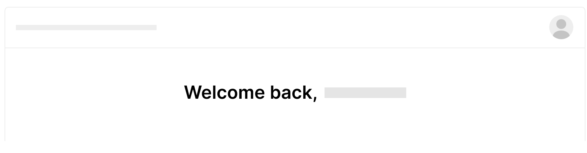

## Intro

새로운 프로젝트를 하게 되면서, 프로젝트에 적용할 많은 새로운 스펙을  찾아보았고, **Preact + Vite**를 메인으로 사용하였다. 관련하여 글을 작성하였으니 궁금하면 [Preact, Vite 일주일 사용후기](https://snyung.com/content/2020-12-20--Preact%20Vite%20%EC%9D%BC%EC%A3%BC%EC%9D%BC%20%EC%82%AC%EC%9A%A9%ED%9B%84%EA%B8%B0)를 확인하길 바란다.

그중 Store 관리를 위한 도구로 Redux VS Context + Reducer를 고민했으나, 전역으로 Store를 관리하는 데 있어 불편함을 느끼던 찰나, 같은 고민을 하시던 분들의 글을 읽고 SWR를 도입하였다. 사용해본 결과 공유를 하면 좋을 거 같아 작성하였다.

## What

[공식사이트](https://swr.vercel.app) 상단에 단순하고 명확하게 무엇인지 알려주고 있다.

> **React Hooks library for data fetching**

**데이터를 가져오기 위한 React Hook 라이브러리**이다. SWR의 이름은 `HTTP RFC 5861`에서 사용되는 HTTP 캐시 무효화 전략인 `stale-while-revalidate`에서 가져왔다.

SWR의 전략은 캐싱된 데이터가 있으면 먼저 가져오며, 서버 데이터 가져온 후 마지막으로 최신의 데이터를 업데이트한다.

### 특징

- Lightweight
- Backend Agnostic
- Realtime
- [Jamstack](https://snyung.com/content/2021-01-08--JAMstack) Oriented
- TypeScript Ready
- Remote + Local

## 사용법

### 기본형태

SWR의 기본형태는 아래와 같다.

```jsx
import useSWR from 'swr'

function Profile() {
  const { data, error } = useSWR('/api/user', fetcher)

  if (error) return <div>failed to load</div>
  if (!data) return <div>loading...</div>

  return <div>hello {data.name}!</div>
}
```

`useSWR`로 React Hook으로, 주된 인자로 key와 fetcher가 있다. 첫 번째 인자는 API URL면서 캐싱할 때 사용되는 key가 된다. 이는 `useSWR('/api/user', fetcher)`를 여러 컴포넌트에서 사용하여도 같은 key의 데이터가 있다면 캐싱된 것을 가져오는 것이다.

두 번째 인자는 fetcher이다. [Fetch API](https://developer.mozilla.org/en-US/docs/Web/API/Fetch_API)를 기본으로 하며, 제일 많이 사용되는 [Axios](https://github.com/axios/axios)나 [GraphQL](https://graphql.org/)을 사용할 수 있다.

자세한 내용은 아래의 사이트를 참고하면 된다.

> [SWR - Data Fetching](https://swr.vercel.app/docs/data-fetching)

## Why

SWR은 왜 나오게 되었으며, 왜 사용하게 되었나 간단한 예제를 통해서 살펴보자.



위와 같은 화면이 있다고 하자.

Website에서는 Avatar와 Content 둘 다 user 데이터를 사용하는 것을 볼 수 있다. 예전부터 우리는 상위 컴포넌트 `useEffect`에서 Data Fetching하고 props를 통해서 하위 컴포넌트에 데이터를 전달하는 방식이었다. 

이러면 Data Fetching을 상위 컴포넌트에서 유지하고 모든 컴포넌트에 데이터를 props로 넘긴다. 새로운 데이터 또는 컴포넌트가 늘어나게 되면 다시 상위 컴포넌트의 구조를 바꾸고 하위 컴포넌트에서 필요한 데이터는 추가, 변경하여 하위 컴포넌트로 넘긴다.

그러나 상위 컴포넌트에 모든 것을 하게 되면서 관리의 어려움이 발생한다.

```jsx
// page component
function Page () {
  const [user, setUser] = useState(null)

  // fetch data
  useEffect(() => {
    fetch('/api/user')
      .then(res => res.json())
      .then(data => setUser(data))
  }, [])

  // global loading state
  if (!user) return <Spinner/>

  return <div>
    <Navbar user={user} />
    <Content user={user} />
  </div>
}

// child components
function Navbar ({ user }) {
  return <div>
    ...
    <Avatar user={user} />
  </div>
}

function Content ({ user }) {
  return <h1>Welcome back, {user.name}</h1>
}

function Avatar ({ user }) {
  return 
}
```

props의 사용을 피하기 위해서 Context를 사용한다. 이 역시 Dynamic Component에서 문제가 발생한다. 페이지 내 Component가 Dynamic 할 경우 최상위 컴포넌트는 자식 컴포넌트의 어떤 데이터가 필요한지 알지못할 수 있다.

SWR은 이 문제를 해결해준다.

```jsx
// page component
function Page () {
  return <div>
    <Navbar />
    <Content />
  </div>
}

// child components
function Navbar () {
  return <div>
    ...
    <Avatar />
  </div>
}

function Content () {
  const { user, isLoading } = useUser()

  if (isLoading) return <Spinner />

  return <h1>Welcome back, {user.name}</h1>
}

function Avatar () {
  const { user, isLoading } = useUser()

  if (isLoading) return <Spinner />

  return 
}
```

간단하게 `useSWR` Hook를 해당 데이터가 필요한 컴포넌트에 바인딩한다. 이렇게 되면 상위 컴포넌트가 데이터를 가지면서, 전달에 신경 쓸 필요가 없다.

쉽게 말하면 컴포넌트가 필요로 하는 데이터를 필요한 곳에 바인딩하는 것이다. Container 컴포넌트는 사용하지 않아도 된다.

같은 SWR 키를 사용하면, 요청에 대해 자동으로 중복제거, 캐시, 공유되어 API 요청이 하나만으로 가능하다.

또 하나 좋은 기능으로 아래 상황에서 자동으로 revalidate 한다.

- User Focus
- Network Reconnect
- 탭 전환
- 절전 모드 해제

## How

새로운 기술을 적용하기에 앞서 항상 해당 기술이 현재 사용하고 있는 것을 대안으로 할 만큼 Cover 하나 확인하고 검증하는 단계가 필요하다. 

두 가지를 살펴보도록 하자.

### mutate(local + remote)

Data Fetching은 파악되었다. 그러나 현재 웹사이트의 수정이 일어나게 되면 서버로 요청하고 서버의 데이터를 다시 요청해서 업데이트하는 방식은 네트워크 비용이 들기에 유저에게 좋지 못한 경험을 준다.

대신 데이터를 로컬로 업데이트하는 것이 서버의 데이터를 변경해서 반영하는 방법보다 더 좋은 방법이다.

`mutate`를 사용하면 로컬 데이터를 업데이트하는 동시에 유효성을 다시 검사하고 최신 데이터로 바꿀 수 있다.

```jsx
import useSWR, { mutate } from 'swr'

function Profile () {
  const { data } = useSWR('/api/user', fetcher)

  return (
    <div>
      <h1>My name is {data.name}.</h1>
      <button onClick={async () => {
        const newName = data.name.toUpperCase()
        
        // 로컬 데이터를 바로 업데이트한다. 대신 3번째 인자를 false로 두어 재요청을 하지 않는다.
        mutate('/api/user', { ...data, name: newName }, false)
        
        // 데이터를 업데이트하는 요청을 한다.
        await requestUpdateUsername(newName)
        
        // 재요청을 한다.
        mutate('/api/user')
      }}>Uppercase my name!</button>
    </div>
  )
}
```

위와 같이 로컬 데이터를 우선적으로 업데이트하여 유저에서 변경사항을 보여주며 수정 API를 동기적으로 요청 후 완료가 되면 수정된 데이터를 가져와서 로컬데이터를 업데이트 한다.

더 자세한 내용은 아래의 주소를 참고하면 된다.

> [mutate](https://swr.vercel.app/docs/mutation)

### Reusable

useSWR을 각각의 컴포넌트에 적용하는 방법도 충분히 간단하지만, 더 쉽게 Hook으로 구성해서 사용할 수 있다. 

한 개의 API를 호출할 때도 유용하지만 2개이상의 API를 같이 사용하는 데이터 형식에서도 유용하다.

```jsx
function useUser (id) {
  const { data, error } = useSWR(`/api/user/${id}`, fetcher)

  return {
    user: data,
    isLoading: !error && !data,
    isError: error
  }
}
```

```jsx
function Avatar ({ id }) {
  const { user, isLoading, isError } = useUser(id)

  if (isLoading) return <Spinner />
  if (isError) return <Error />

  return 
}
```

위와 같은 패턴으로 사용하면 명령적 방식으로 사용하지 않고, 원하는 컴포넌트에 원하는 데이터를 넣는 선언적 방식으로 사용할 수 있다.

## 마무리

물론 Redux를 사용해서 Selector와 Dispatch를 사용해서도 할 수 있다. 그러나 Redux를 사용하더라도 데이터를 가져와 저장하고 Selector를 지정하는 등 많은 것을 해야해서 불편함을 느꼈다. 그러던 중 각각의 컴포넌트별 사용할 데이터를 선언적으로 개발할 수 있다는 건 정말 좋았다. 

한 가지 아쉬운 것은 Fetching 이외의 수정, 삭제는 따로 개발해서 사용해야한다.

현재 SWR 이외의 Data Fetching하는 도구는 많이 나오고 있다. 앞으로 더 좋은 도구들이 나오길 바라며, 앞으로 행보가 기대된다.

> SWR에 대해서 추가적으로 학습한 내용을 추가했습니다. 👇

| | |
|:--:|--|
| **SWR이란** | [Redux 말고 SWR](/content/2021-01-09--SWR) |
| **SWR 더 나아가기** | [SWR / react-query useMutation처럼 사용하기](/content/2021-04-25--SWR-useMutation) |

#### Reference

- [SWR 공식사이트](https://swr.vercel.app)
- [전역 상태 관리에 대한 단상 (stale-while-revalidate)](https://jbee.io/react/thinking-about-global-state/)

