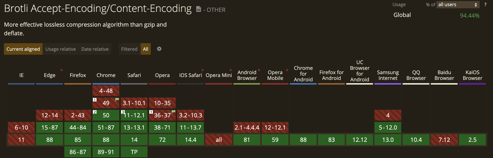
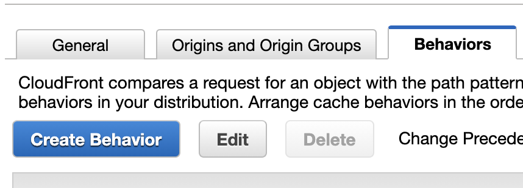
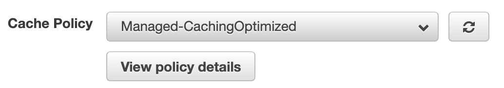
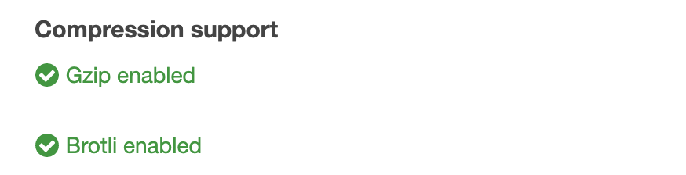
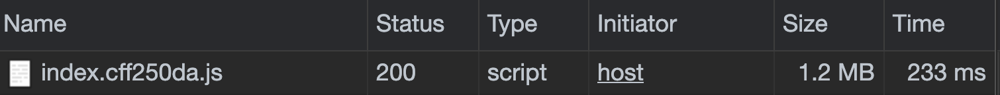
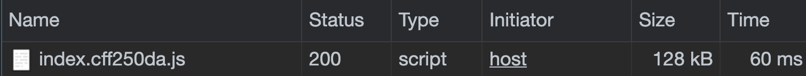

2016년 Google은 새로운 2가지 압축기술을 공개했다.

**Zopfli** 와 **Brotli** 이다.

오늘의 메인이 되는 주제는 Brotli이지만 그 전에 Zopfli에 대해서도 알아보면 좋겠다는 생각에 정리하였다.

## Zopfli

기술이 발전하면서 파일 사이즈는 증가하고, 이에 네트워크 부담도 늘어나게 되었다. 압축기법도 발맞추어 발전하면서, 우리는 새로운 압축기법으로 네트워크 전송 부하를 줄여주고 있다.

7-zip, rare 등등 많은 압축 포맷이 존재하고 있다. 그러나 역시 우리가 제일 잘 알고 있는 것은 zip일 것이다.

많은 곳에서 사용하고 있으며 HTTP 전송에서도 사용하고 있다.

그러나 한계가 존재한다. 신형 포맷들보단 압축률이 현저히 떨어진다. 그래서 구글에서 만든 것이 **Zopfli**다. Zopfli은 기존 zip의 압축률을 향상시키는 알고리즘이다.

> 이름은 빵 이름인 Zopf에서 왔다고 한다.

## Brotli

Zopfli는 **기존 zip과의 호환성을 유지하기 위해 성능을 희생한 알고리즘**이라고 한다. HTTP 압축과 같이 실시간성이 보장되어야 하는 환경에서는 좋지 않다.

이를 위해서 나온 알고리즘이 **Brotli**다.

이 방식은 기존의 압축포맷들과는 전혀 호환성이 없다.

무손실 압축기법으로 LZ77 알고리즘의 최신 변형 조합하였다고 한다. Gzip과 비교되는 압축기법의 하나로 장점은 Dictionary를 사용해서 전체 키워드가 아닌 키만 보낸다고 한다.

zip에서 사용되는 deflate와 꽤 연관이 있다고 하지만, 별도의 포맷이다. 또한 deflate보다 더 빠르면서도 압축률이 좋은 것이 특징이다. 압축률이 최대 20% 더 좋아진다고 한다.

즉, HTTP 압축과 같이 실시간성이 보장되어야 하는 환경에서는 deflate를 대체할만한 능력을 갖췄다.

이러한 특징이 있기 때문에 이미 Modern Browser에서는 사용되고 있다.

> Can I Use - Brolti

HTTP 압축 시 기존 deflate, gzip에 비해 압축률이 향상되어 전송 시간이 줄어드는 것은 사실이다. 하지만, 최대 20%까지 향상될 수도 있을 뿐 그 이상의 효율을 기대할 수는 없다. 또한, 전송시간만 줄어드는 것일 뿐 그 외의 분야에는 영향이 없다.

웹에서 제공하는 2가지 방법으로는 **웹서버에서 제공**하는 방법과 **CDN에서 활성화**하는 방법이 있다.

CDN으로 활성화하는 방법은 하단에 AWS CloudFront에서 설정하는 방법으로 추가하였다.

> 이름은 빵 이름인 Brot에서 왔다고 한다.

## Brotli vs Gzip

이미 우리는 Gzip이라는 알고리즘에 대해서 알고 있다.

Gzip과 Brotli를 비교하는 많은 사이트가 있는데 그 중 [certsimple](https://certsimple.com/)에 따르면,

- Gzip보다 Brotli가 JS 파일을 14% 더 작게 압축한다.
- Gzip보다 Brotli가 HTML 파일을 21% 더 작게 압축한다.
- Gzip보다 Brotli가 CSS 파일을 17% 더 작게 압축한다.

Brotli가 전체적으로 압축률이 높았다.

> Image에서는 이미 압축되어 있어 Brotli를 사용하게 되면 사이즈가 더 커진다고 한다.

이렇게 더 압축되면, 전송되는 바이트의 수가 적어지게 되며, 페이지 로드 속도는 올라가고 CDN 비용도 절감된다.

## CloudFront에서 Brotli 사용하기

지난 2020년 9월 15일 [AWS CloudFront에서 Brotli를 지원](https://aws.amazon.com/ko/about-aws/whats-new/2020/09/cloudfront-brotli-compression/)한다고 나왔다.

Gzip보다 더 뛰어난 압축률로 비손실 압축을 사용하여 AWS에서도 사용할 수 있게 된 것이다.

간단하게 CloudFront를 설정하여 Brotli를 사용해보자.

### 1. 설정으로 들어가기 

만들어진 CloudFront에서 Behaviors 탭에서 설정할 항목을 선택하고 Edit으로 들어간다.

> CloudFront 설정법은 다른 곳을 참고하시길 바랍니다.

---

### 2. Cache Policy 설정

중간에 위치한 Cache Policy 항목에서 **Managed-CachingOptimized** 를 선택하게 되면 Gzip과 Brolti를 둘 다 제공하게 된다.

> 자신만의 Policy를 만들어서 설정하셔도 됩니다.

> Managed-CachingOptimized 설정 시 Gzip과 Brolti 지원

---

### 3. Compress Objects Automatically 설정

Cache Policy를 설정하여도 Compress Objects Automatically 설정을 **Yes**로 해주지 않으면 정상 작동하지 않습니다.

---

### 결과물

초기 사진을 보게 되면 사이즈부터 **1.2MB**인 것을 확인할 수 있다. 한 파일을 내려받는데 **233ms**로 아주 느리지 않다고 생각할 수 있지만 압축된 모습을 보게 되면 느리다고 생각할 수 있다.

위의 사진은 AWS CloudFront에서 Brotli 압축설정을 한 후이다. 두 개의 파일이 같다는 것은 이름을 참고하면 된다.

위의 1.2MB였던 파일 사이즈는 **128kb**가 되었으며 내려받는 시간은 **60ms**로 **약 2.5배** 빨라졌다.

마지막으로 파일의 Request Headers에서 **contents-encoding: br**로 Brotli가 적용된 것을 볼 수 있다.

## 마무리

작성하면서 들었던 생각은 크게 와닿지 않다는 것이었다. 2016년 발표가 되었지만 많은 글을 보지 못하였고, AWS조차 2020년 9월이 되어서야 지원하기 시작했다. 또한, Gzip과 큰 차이를 느끼지 못했기 때문인 것 같다. 

Gzip을 사용하게 되면 위의 파일이 164kb로 큰 차이 나보이지만 내려받는데 61ms로 1ms 차이밖에 나지 않았다.

새로운 알고리즘으로 압축률은 눈에 띄게 좋아졌지만, 현재의 네트워크에서는 큰 차이를 느끼지 못했다. 그러나 추후 HTML, JS, CSS의 파일이 더욱 커지게 된다면 압축되는 크기의 차이는 더 벌어지게 되고 속도에 영향을 많이 미칠 것으로 기대하고 있다.

#### Reference

- [Brotli vs Gzip Compression. How we improved our latency by 37%](https://medium.com/oyotech/how-brotli-compression-gave-us-37-latency-improvement-14d41e50fee4)
- [Can I Use : Brotli](https://caniuse.com/?search=brotli)
- [Amazon CloudFront, Brotli 압축에 대한 지원 발표](https://aws.amazon.com/ko/about-aws/whats-new/2020/09/cloudfront-brotli-compression/)
- [브로틀리 압축(Brotli Compression)으로 속도를 개선해 보기](https://happist.com/561373/%EC%82%AC%EC%9D%B4%ED%8A%B8-%EC%86%8D%EB%8F%84-%EA%B0%9C%EC%84%A0-%EB%B8%8C%EB%A1%9C%ED%8B%80%EB%A6%AC-%EC%95%95%EC%B6%95brotli-compression%EC%9C%BC%EB%A1%9C-%EC%86%8D%EB%8F%84%EB%A5%BC-%EA%B0%9C)
- [brotli github](https://github.com/google/brotli)
- [구글이 공개한 두 가지 압축 기술: Zopfli와 Brotli](https://teus.tistory.com/410)

