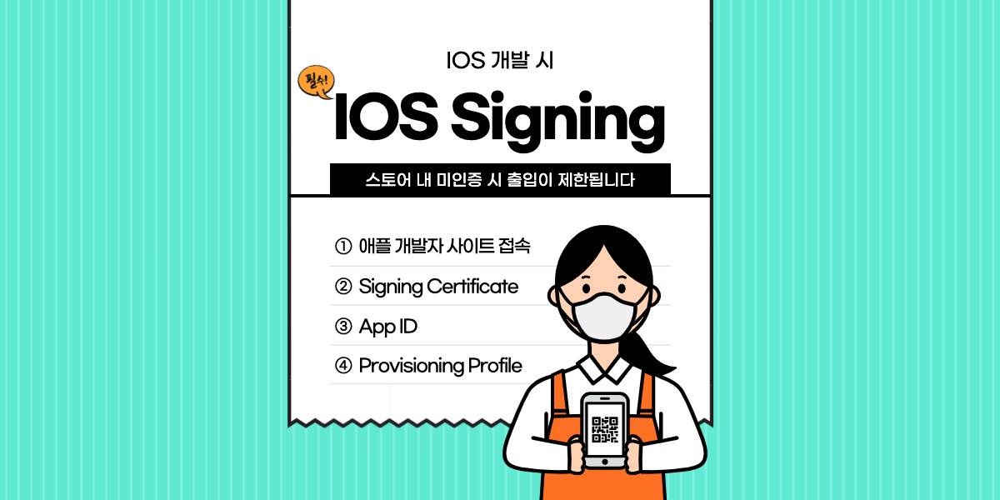

> 회사에서 RN(React Native)을 사용할 수 있는 날이 왔다. 개발을 위한 한 달간 사전 공부를 하고 [테스트 레포](https://github.com/SeonHyungJo/rn-practise)도 만들어 보며 준비를 하였으나 진행해보니 어려움이 많다는 걸 느꼈다. 그동안의 경험과 느낌을 공유하는 시간을 가지고 싶어 시리즈 글을 작성하게 되었다.

## Intro

처음 앱개발을 공부하게 되면 웹과는 다른 생소한 것이 존재한다. 바로 **Signing(인증서)**이다. 개발을 하고 나면 인증기관에 인증을 받아야만 각각의 스토어에 올릴 수 있게 되는 것이다.

IOS, 안드로이드 중 IOS가 복잡해서 이번 기회에 제대로 정리하고 넘어가려고 한다. 다른 글을 이해하는데 선행되는 글이기도 하다.

## Apple Certificate Authority - 애플 인증 기관

우선 Apple Certificate Authority를 알아야 한다. 인증 기관은 다양하게 존재하지만, App Store Connect(앱스토어에 배포)를 하기 위한 유일한 인증 기관이 **Apple Certificate Authority**다. 

> App Store Connect는 Apple Store의 Gateway다.

IOS 개발자가 첫 번째로 해야 할 일은 Signing Certificate를 만드는 것이다. Signing Certificate는 Apple이 개발자에 대해서 알고 있음을 보장해준다.

이는 Apple에서 제공하는 공개/개인키 세트를 생성하는 것이다. 이러한 과정은 Signing Certificate 생성 시 Apple 인증기관과 개발자(또는 개발팀)를 연결해준다.

그 이후 App 또는 App Extention의 App ID를 만든다. App ID는 Signing Certificate를 App(Bundle ID로 식별되는)과 연결한다.

마지막으로 하나 이상의 Provision Profile을 생성한다. 각각의 Profile은 App ID 중 하나의 연결을 명시하며 특정 빌드가 Development, Ad Hoc distribution, Release 중 어느 것인지 여부를 명시하고 있다.

## Signing Certificate - 서명 인증서

Signing Certificate에는 development(개발)과 distribution(배포)의 두 가지 유형이 있다.

개발 인증서는 사용자를 개발자로 식별하며 개발자 식별자를 포함한다.
배포 인증서는 팀 식별자가 포함되어 있으며 팀을 식별한다.

두 인증서 모두 유용하지만 배포 인증서만 App Store에 등록하는 앱에 서명하는데 사용할 수 있다. 또한 Apple 개발자를 개인으로 등록하더라도 개발자와 팀 식별자를 모두 가지게 된다. (두 식별자는 모두 짧은 16진수 문자열이다)

Signing Certificate를 생성하려면 먼저 Mac에서 keychain access app을 사용하여 인증서 서명 요청을 생성한다. 이렇게 하면 인증서를 식별할 공개, 개인키가 생성된다. 그리고 인증서로 전환할 수 있는 `developer.apple.com`에 올린다.

결국 인증서는 사용자가 Apple을 알고 있으며, Apple이 사용자(또는 팀)를 알고 있음을 보장해준다.

인증(`.cer` 파일 형식)을 받으면 Xcode 및 빌드 과정에서 사용할 수 있도록 keychain에 추가한다. 이 모든 작업이 끝나면 인증서로 서명된 모든 항목이 사용자의 것이라고 보증된다.

## App ID(s)

Xcode를 사용하여 새로운 앱을 만들 때 Bundle ID를 입력해야 한다. 이는 앱을 고유하게 식별하는 문자열이다.

Apple은 인터넷 주소를 사용하여 **역방향 도메인 이름 형식**을 사용할 것을 권장한다. (그런데 무조건 역방향으로 하던데) 

실제 요구 사항은 Bundle ID가 고유해야 한다는 것이다. 즉, Bundle ID는 이전에 앱이 사용한 것을 사용할 수 없다. 이것이 Apple이 역 도메인을 권장하는 이유다. 역도메인을 사용하게 되면 Bundle ID가 충돌할 가능성이 줄어들게 된다고 한다.

위에서 언급했듯이 모든 앱과 모든 앱 확장에는 고유한 Bundle ID가 있어야 하므로 고유한 App ID가 필요하다. 따라서 연결된 앱에는 3가지 App ID가 있는 것이다.

1. com.company.appname
2. com.company.appname.kitapp
3. com.company.appname.extention

App ID에는 고유한 Bundle ID와 와일드카드 App ID, 두 가지 유형이 있다.

와일드카드 App ID에는 별표(*)가 포함되어 있고 때로는 단독으로 포함되어 있기 때문에 쉽게 인식할 수 있다.

> com.company.* : 와일드카드 App ID

와일드카드 App ID를 사용하면 Release 하기 전까지 Bundle ID를 결정하기 않고 앱을 개발할 수 있다.

App ID를 생성하는 다른 방법이 있지만, [developer.apple.com](https://developer.apple.com) 웹 사이트에서 App ID를 생성하는 것이 좋다. App ID Record는 사용자 팀 ID 참조가 포함되어 있다. 이것은 사용자가 이 앱을 책임진다는 것을 보장한다.

사용자 App ID Record는 사용하려는 권한 목록도 포함되어 있다. 권한은 앱에서 지원하려는 추가 서비스 또는 동작이다. Xcode 앱의 기능 탭에서 권한을 활성화할 수 있으며, App ID의 앱 서비스 섹션에서 권한을 활성화하지 않은 앱은 해당 동작 API에 접근할 수 없다.

App ID에서 활성화하지 않은 기능을 Xcode에서 선언하면 Ad Hoc 또는 Release 빌드를 실행하려고 할 때 서명 오류가 발생한다. 

> 권한 = 기능 = 앱 서비스(Entitlement = Capabilities = App Services)

## Provisioning Profiles

Provisioning Profile은 앱과 팀에 대한 모든 정보를 결합한 것이다. Provisioning Profile에는 배포(development, ad hoc, App Store)에 대한 정보가 포함되며, 테스터와 같은 대상으로 지정한 특정 장치 리스트도 포함될 수 있다. 

빌드 프로세스 중에 앱의 유효성을 검사하는 것은 팀 또는 개인 Signing Certificate와 Profile이다.

## Device List

Development, Ad Hoc 배포를 하려면 앱을 로드할 수 있는 장치를 지정해야 한다. 지정하려면 Apple developer 사이트에서 인증서, 식별자 및 Profile 섹션의 일부인 장치 목록에 장치의 UDID와 이름을 추가한다.

## 정리

- 모든 것은 Apple Certificate Authority에서 시작한다.
- Apple에서는 사용자의 신용카드나 D&B 번호를 통해서 Apple ID에 대한 신청서를 통해 사용자가 누구인지 알고 있다. 사용자의 Apple ID는 사용자의 팀 또는 사용자를 개발자로 식별한다.
- App ID는 App 또는 Extention을 식별하고 Signing certificate는 특정 사용자의 것이라고 보증한다.
- Provisioning Profile은 위의 모든 사항을 통합하고 앱을 배포할 수 있는 위치(개발, 테스트, 앱스토어)와 방법을 식별한다.

# App Distribution(앱 배포)

앱 배포에는 4가지 종류가 있다. Development, Ad Hoc, App Store에 대해서 살펴보자.

Provisioning Profile을 생성할 때 profile이 의도된 배포를 선택해야 한다.

- Development profile로 검증된 앱은 시뮬레이터 또는 개발자의 기기에서만 실행 및 디버깅할 수 있다.
- Ad Hoc profile로 검증된 앱은 제한된 수(약 100대)의 테스트 장치에서 실행할 수 있다. 이는 QA 조직에 배포하는데 유용하다.
- App Store profile로 검증된 앱은 iTunes App Store에 제출할 수 있다.

앱 배포의 각 버전에는 Provisioning Profile, App ID, Signing Certificate에 포함되어야 하는 내용에 대한 고유한 요구 사항이 있다.

## Development Distribution

Development Profile이 가장 여유롭다. 팀 또는 개인 Signing certificate를 사용할 수 있다. 명시적 Bundle ID 나 와일드카드 Bundle ID를 사용할 수 있다.

## Ad Hoc Distribution

Team Signing certificate를 사용해야 한다. 명시적 Bundle ID를 사용해야 하며, Team Signing certificate를 참조해야 한다. 마지막으로 앱을 사용할 수 있는 장치도 지정해야 한다. 

## App Store Distribution

Team Signing certificate를 사용해야 한다. 명시적 Bundle ID를 사용해야하며, Team Signing certificate를 참조해야 한다. 마지막으로 물론 Provisioning Profile에서 App Store 배포를 지정해야한다.

App Store에서 허용하는 앱이 있다고 가정하고, App Store Provisioning Profile를 사용하여 앱에 서명하면 앱을 [appstoreconnect.apple.com](appstoreconnect.apple.com)에 업로드 할 수 있다. 그러나 App Store Connect에 앱을 업로드하려면 먼저 앱 항목을 만들어야한다.

App Bundle ID와 App name을 지정하는데 있어 Apple에서 둘 중 하나는 거부될 수 있다(이미 있는 경우). Bundle ID나 App name은 개발자 웹사이트가 아닌 App Store Connect에서만 고유성에 대해 검증된다. 따라서 사용하려는 App name과 Bundle ID가 확실하다면 개발 프로세스 초기에 App Store Connect Record를 생성하는게 좋다.

승인된 App Store Connect 기록이 있고, 앱이 업로드되어도 알려지지 않은 단계가 있다. Apple은 앱을 평가하고 앱 스토어에서 승인해야한다. 그 시점에서 Apple은 Apple certificate과 Profile로 다시 서명한다(?).

## 👋 Outtro

개발 당시에는 개발하기 바빠서 IOS 인증과 관련된 내용을 자세히 살펴보지 못하다가, 글로 적으니 정리할 수 있었다. 이번 기회로 모두가 개념이 잡혔으면 한다.

이후에 올라오는 시리즈 글도 재밌게 읽어주세요.

#### RN 개발기

| | |
|:--:|--|
| **IOS Signing(인증서) 제대로 알고 사용하기** | [현재 페이지](/content/2021-08-22--IOS-Signing(인증서)-제대로-알고-사용하기) |
| 앱 개발 유용한 Firebase 기능 | [살짝 읽어보기](/content/2021-08-25--앱-개발에-유용한-Firebase-기능) |
| React Native Webview 개발기 | [준비중]() |
| fastlane으로 간편하게 앱(Android, IOS) 배포하기 | [준비중]() |

#### Reference

- [[iOS 앱 배포 준비] 애플에 배포하기 위한 4가지 개념](https://ios-development.tistory.com/246?category=936128)
- [Demystifying the iOS App Provisioning Process](https://www.bounteous.com/insights/2018/08/08/demystifying-ios-app-provisioning-process/)
