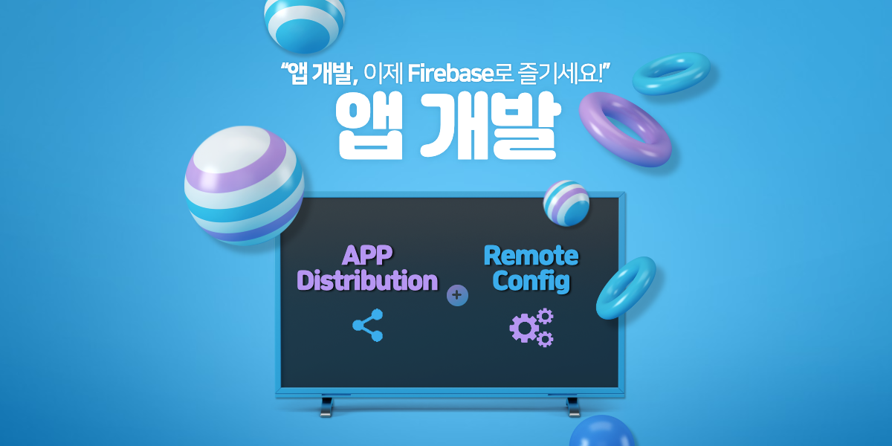

> 회사에서 RN(React Native)을 사용할 수 있는 날이 왔다. 개발을 위한 한 달간 사전 공부를 하고 테스트 레포도 만들어 보며 준비를 하였으나 진행해보니 어려움이 많다는 걸 느꼈다. 그동안의 경험과 느낌을 공유하는 시간을 가지고 싶어 시리즈 글을 작성하게 되었다.

## Intro

두 개의 플랫폼을 같이 신경 써야 한다는 것은 생각한 것보다, 더 어렵고 까다로운 작업이었다. *갓구글*은 역시 이를 이미 알고 개발자들에게 도움을 주는 도구를 많이 만들고 있었다. 그 중에서 이번 개발에 사용해보고 좋다고 생각한 두 서비스를 소개하려고 한다.

> 소개하는 서비스는 [Firebase](https://firebase.google.com/?hl=ko)에서 제공하고 있다.

## 1. App Distribution

앱 개발을 완료하고 테스트를 하기 위해서 테스터들에게 앱 테스트 버전을 배포하는 것은 생각보다 많은 일이 수반되는 작업이다.

예를 들어, 하나의 버그가 발견되면 `코드 수정 → 테스트 빌드 → 테스트 앱 배포`라는 배포 프로세스를 진행해야 한다. 

여기서 중요한 것은 개발하면서 한 번에 테스트가 통과된다면 좋지만, 그렇지 못하다는 것을 우리는 이미 잘 알고 있기에 배포를 편하게 해주는 툴이 있다면 바로 사용하고 싶을 것이다.

이를 알고 만들어진 것이 **App Distribution**이다.

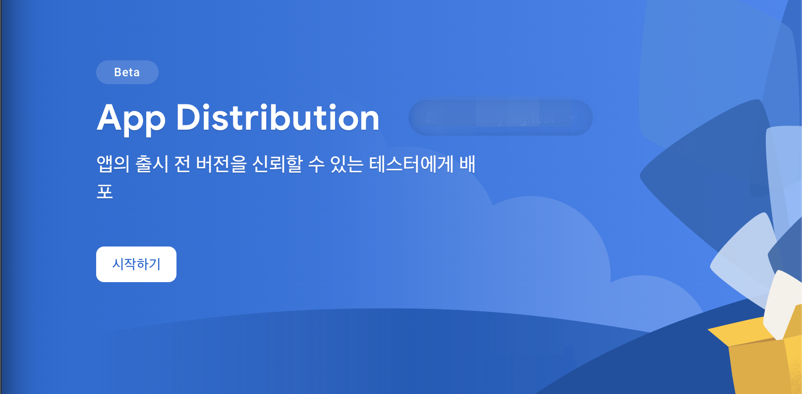

App Distribution은 firebase에서 제공하는 Beta 서비스(2021.08.22 기준)로 위에서 보이듯 **앱의 출시 전 버전을 신뢰할 수 있는 테스터에게 배포**해주는 서비스이다. 

구글에서 만든 서비스이지만 IOS 배포에 있어 더욱 빛을 발한다. IOS은 이미 TestFlight라는 테스터 배포 서비스가 있다. TestFlight로 테스트 배포를 하는데 앱이 작동하지 않는 경우도 발생한 적이 있으며, 버그도 발생한 적이 있었다. 지금까지 TestFlight는 Apple에서 지원한다는 이유로 사용할 수밖에 없었다. 

App Distribution는 빌드하고 사이트에 올리기만 하면 설정한 테스터들에게 메일로 알려주고 바로 다운받을 수 있게 되어있어 테스터들 입장에서도 간단하다.


### 1-1. 배포 대시보드

IOS, Android 테스트 배포를 한 곳에서 하게 되어 따로 관리하는 것이 아닌 한 사이트에서 앱 선택창에서 선택하는 것만으로 관리현황을 바꿔가면서 볼 수 있다는 장점이 있다.

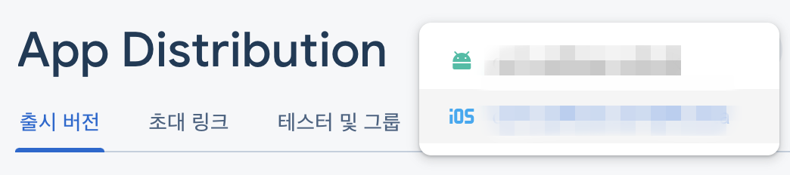

위에서 관리할 앱을 선택하면 아래와 같이 배포한 앱의 **버전 관리, 출시 노트, 배포, 다운로드 현황**을 확인할 수 있다. 또한, 오래된 버전은 특정일 이후에 삭제가 되며, 그전까지는 마음대로 이전 버전과 현재 버전을 선택해서 다운받을 수 있다.

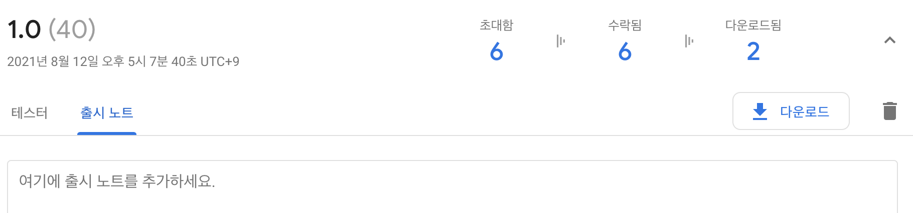

개인적으로 좋다고 생각한 것은 출시 노트를 간단하게 작성할 수 있다는 것과 다운받은 테스터의 현황도 볼 수 있는 것이었다.


### 1-2. 테스터 관리

다른 장점으로는 테스터 그룹을 만들고, 관리하며, 그룹별 배포가 가능하다는 것이다.

물론 QA분들에게 전달하는 것일 수 있지만, 다른 내부 직원들에게 배포를 하는 경우도 생길 수 있으며, 특정 기기를 대상으로 배포하는 경우 + 개발자들에게만 배포할 때 유용하게 사용할 수 있다.

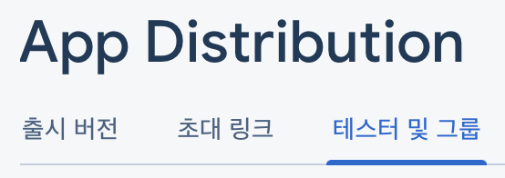

> 👆 App Distribution 메인 메뉴

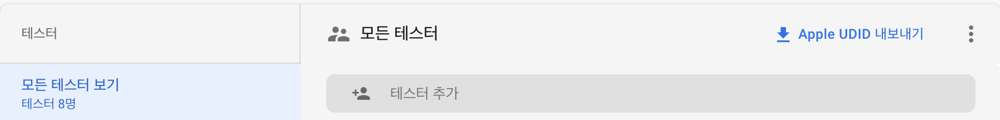

> 👆 테스터 및 그룹 관리 페이지

우선 *모든 테스터 보기*에서 모든 테스터를 추가한다. App Distribution은 배포 앱을 테스터 메일로 알려주기 때문에 메일을 추가하면 된다. 모든 테스터를 추가했다면 원하는 기준에 맞게 그룹을 지어주면 좋다.

개인적으로 플랫폼별 그룹을 나누는 게 좋다고 생각하여 안드로이드와 IOS를 구분하였으며, 추가로 개발자들에게만 배포하는 일이 생길 것을 대비하여, FrontEnd 그룹으로 나누었다.

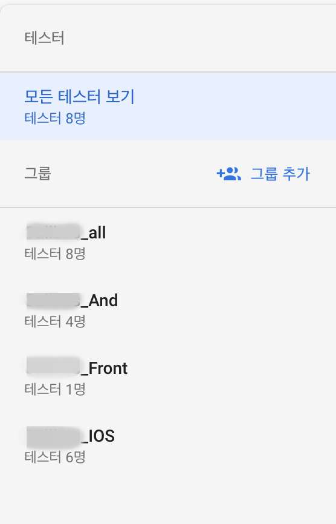

> 👆 테스터 그룹 리스트


### 1-3. 테스터 배포

앱 배포는 간단하다. 빌드를 하고 나온 결과물인 `IPA` 또는 `APK` 파일을 드래그 앤 드랍으로 넣어준다.


위에서 설정한 그룹 중 배포를 하고 싶은 그룹을 선택하면 대상 테스터들에게만 메일이 발송된다.

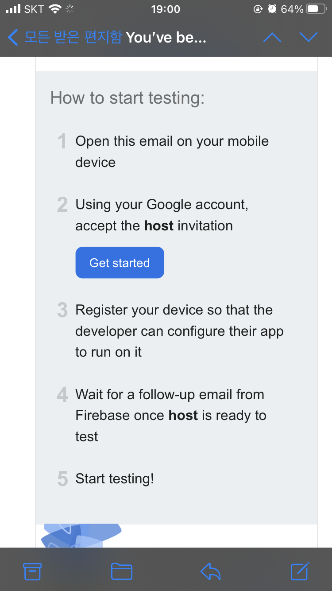

처음 발송된 메일을 받게 되면 Firebase에서 알려주는 순서에 맞게 실행하게 되면 앱 설치까지 이동한다. IOS는 추가적인 작업이 필요하다. Apple의 전략에 따라서 Device UDID를 개발자 사이트에 등록하고 새로운 Privision Profile을 가지고 다시 배포해주어야 한다. 테스터가 메일의 내용을 그대로 따라한다면 설정된 개발자 메일로 테스터의 기기명과 UDID를 보내주며, 그 정보를 그대로 개발자 사이트에 등록해주고 다시 배포하면 된다.

> [IOS 인증서에 대해서 자세히 살펴보기](/content/2021-08-22--IOS-Signing(%EC%9D%B8%EC%A6%9D%EC%84%9C)-%EC%A0%9C%EB%8C%80%EB%A1%9C-%EC%95%8C%EA%B3%A0-%EC%82%AC%EC%9A%A9%ED%95%98%EA%B8%B0)

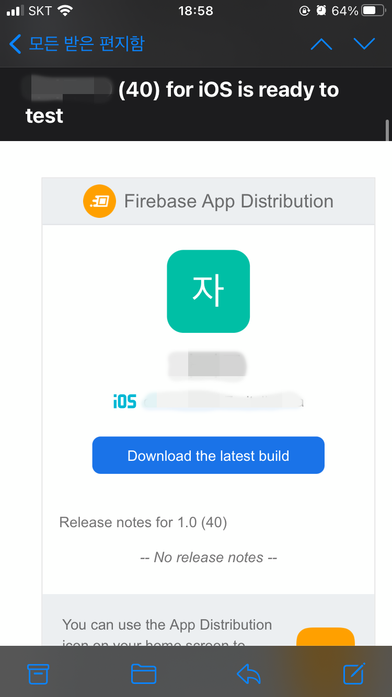

이후에도 추가 테스트 배포가 이루어지면 firebase에서 제공하는 페이지에서 원하는 버전으로 바로 다운받아볼 수 있다.

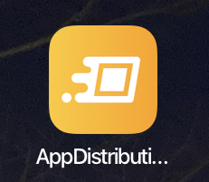

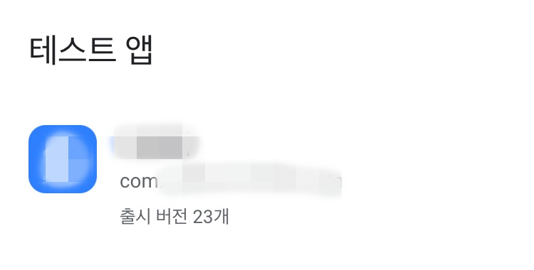

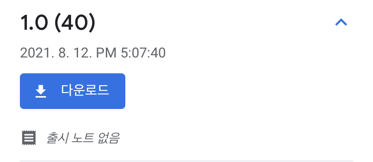

지금까지 App Distribution에 대한 설명이었다. 지금까지 좋은 기능을 살펴보았지만, 이 기능을 더욱더 편하게 이용할 수 있는 방법이 있다. 

[fastlane](https://fastlane.tools/)과 같이 사용하게 되면, command 실행으로 `빌드번호 올리기 + 빌드 + App Distribution 배포`를 한 번에 실행할 수 있다(다음에 올라오는 글을 확인해주세요).

## 2. Remote Config

앱을 배포하고 나면 수정하고 다시 배포하기는 힘들다. 좀 더 실시간으로 변경가능한 환경을 만들어주는 기능이 Remote Config이다.

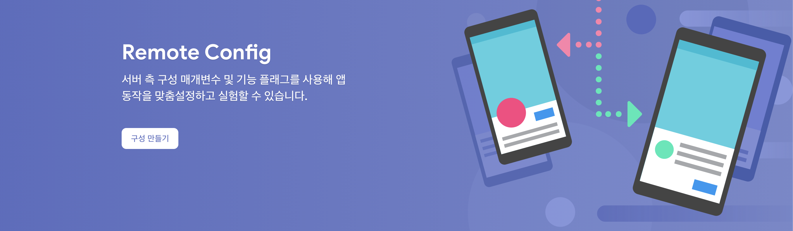

### 2-1 용도

- 사용자층에 따라 다르게 출력하고 싶을 때
- 앱의 업데이트를 알리고 싶을 때
- A/B 테스트

크게 3가지 용도를 작성하였지만, 이외 다른 용도로 사용할 수 있다. 이번 앱 개발에서는 여러 용도 중 앱의 업데이트를 알리기 위해서 사용하였다. Remote Config를 사용하기 위해서는 우선 매개변수의 이름과 값을 설정하고 저장해야한다.

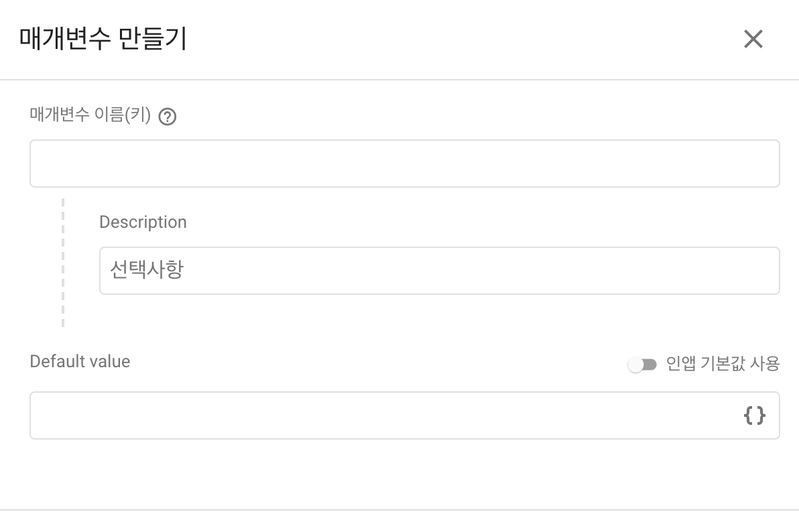

업데이트 내역을 알려주기 위한 기능을 구현하기에 앞서 어떻게 구현할지를 생각했다. 먼저 Remote Config에 안드로이드와 IOS 앱의 최소 설치 버전을 관리하여 각 플랫폼별 최소 버전보다 낮다면 알림창을 띄워 앱 스토어(플레이 스토어)로 이동하게 하는 것이다.

아래와 같이 안드로이드와 IOS의 최소버전 변수 2가지를 추가했다.

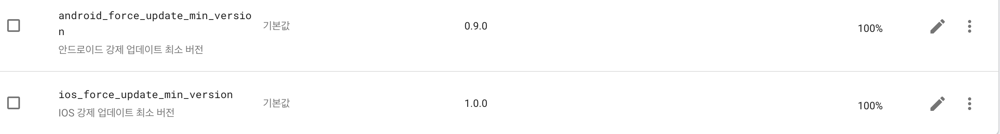

### 2-2 사용해보기

```ts
// IOS를 기준 예제
const REMOTE_IOS_MIN_VERSION = "ios_force_update_min_version";

// 초기화 활성화 과정을 하지 않을 경우 Remote Value와 Sync가 맞지 않는 경우가 생겼다.
await remoteConfig().fetch(); // 초기화
await remoteConfig().activate(); // 활성화

const forcedVersion = remoteConfig().getValue(REMOTE_IOS_MIN_VERSION).asString().split('.').map(Number); // remote config 값 가져오기

// 버전만 관리할 수 있지만 알림창의 타이틀, 코맨트, 버튼명도 관리할 수 있게 구현했다.
const title = remoteConfig().getValue(FORCE_UPDATE_ALERT_TITLE).asString();
const comment = remoteConfig().getValue(FORCE_UPDATE_ALERT_COMMENT).asString();
const buttonTxt = remoteConfig().getValue(FORCE_UPDATE_ALERT_BUTTON_TXT).asString();

// 현재 앱의 버전
const currentVersion = getVersion().split('.').map(Number);

// 현재 앱 버전과 최소 버전을 비교
if (currentVersion[0] < appVersion[0] ||
  (currentVersion[0] === appVersion[0] && currentVersion[1] < appVersion[1]) ||
  (currentVersion[0] === appVersion[0] && currentVersion[1] === appVersion[1] && currentVersion[2] < appVersion[2])
) {
  Alert.alert(
    title || "알림",
    comment || "원할한 사용을 위해 최신 버전으로 업데이트 해주세요.",
    [
      {
        text: buttonTxt || "업데이트 하기",
        onPress: () => {
					// 버튼을 누를 경우 스토어로 이동시키기
          Linking.openURL(storeUrl);

          setTimeout(() => {
            checkRemoteValue();
          }, 3000)
        },
      },
    ],
    { cancelable: false }
  );
}
```

Remote Config에서 설정한 변수명을 상수로 설정해주어 관리한다.

```ts
const REMOTE_IOS_MIN_VERSION = "ios_force_update_min_version";
```

초기 Remote Config를 활성화해주지 않을 경우 데이터 싱크가 맞지 않는 경우가 발생한다. 이를 방지하기 위해 아래와 같은 작업을 선행해야 한다.

```ts
await remoteConfig().fetch(); // 초기화
await remoteConfig().activate(); // 활성화
```

개인적으로 문구도 Remote Config로 관리하여 변경될 수 있도록 구성하였다.

```ts
const title = remoteConfig().getValue(FORCE_UPDATE_ALERT_TITLE).asString();
const comment = remoteConfig().getValue(FORCE_UPDATE_ALERT_COMMENT).asString();
const buttonTxt = remoteConfig().getValue(FORCE_UPDATE_ALERT_BUTTON_TXT).asString();
```

위와 같이 타이틀, 알림 문구, 버튼 문구를 모두 Remote Config로 관리하여 필요시 문구를 변경해서 사용할 수 있다.

마지막으로 무조건 업데이트시키기 위해서 앱 업데이트를 하지 않는 경우 주기적으로 알림을 띄워주어야 한다. 이를 위해 알림 버튼에 이벤트를 추가하였다.

버튼 클릭시 스토어로 우선 보내고 다시 버전을 확인하도록 하여 사용자가 업데이트했는지 확인하도록 하였다.

```ts
Linking.openURL(storeUrl);

setTimeout(() => {
  checkRemoteValue();
}, 3000)
```

## 👋 Outtro

처음 React-Native로 개발하면서 좋다고 생각한 기능을 소개했다. 다음은 실제로 React-Native Webview로 개발한 것을 하나씩 소개해보려고 한다. 나의 경험이 다른 누군가에게 도움이 되길 바란다.

#### RN 개발기

| | |
|:--:|--|
| IOS Signing(인증서) 제대로 알고 사용하기 | [살짝 읽어보기](/content/2021-08-22--IOS-Signing(인증서)-제대로-알고-사용하기) |
| **앱 개발 유용한 Firebase 기능** | [현재 페이지](/content/2021-08-25--앱-개발에-유용한-Firebase-기능) |
| React Native Webview 개발기 | [살짝 읽어보기](/content/2021-08-29--React-Native-Webview-기능-개발) |
| App과 Web 통신하기 | [준비중]() |
| fastlane으로 간편하게 앱(Android, IOS) 배포하기 | [준비중]() |

#### Reference

- [IOS앱 고도화 - Firebase Remote Config를 사용한 앱 운영방법](https://monibu1548.github.io/2018/05/14/firebase-config/)
- [RemoteConfig 이용해서 다이나믹하게 앱 업데이트 하기](https://developer88.tistory.com/158)
- [React-Native Firbase | Remote Config](https://rnfirebase.io/remote-config/usage)

