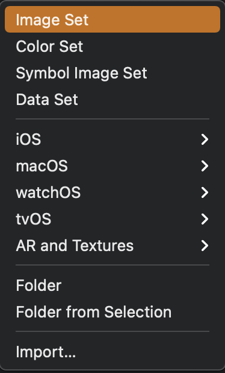
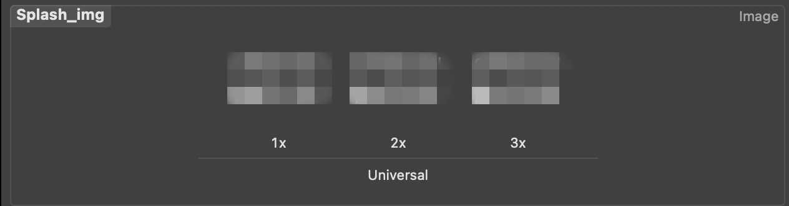

> 회사에서 RN(React Native)을 사용할 수 있는 날이 왔다. 개발을 위한 한 달간 사전 공부를 하고 테스트 레포도 만들어 보며 준비를 하였으나 진행해보니 어려움이 많다는 걸 느꼈다. 그동안의 경험과 느낌을 공유하는 시간을 가지고 싶어 시리즈 글을 작성하게 되었다.

## Intro

드디어 웹 뷰로 기능 개발한 리스트를 소개하는 시간이 왔다. 너무나 개인의 업무성과를 작성하는 글이 될 것으로 생각이 되지만, 개인의 기록이면서 다른 사람의 참고서가 되는 글이 될 수 있도록 최대한 열심히 작성하려고 한다.

모든 기능을 한 달 안에 개발하느라 구현상 부족한 점이 있더라도 이해 부탁드립니다. 댓글은 언제나 감사합니다. 🙏

## 목차

1. [Intro](#intro)
2. [React-Native WebView](#1-react-native-webview)
3. [SafeArea, StatusBar](#2-safearea-statusbar)
4. [앱 아이콘, 스플래시 이미지 추가](#3-앱-아이콘-스플래시-이미지-추가)
5. [앱 이름 바꾸기](#4-앱-이름-바꾸기)
6. [안드로이드 뒤로가기 물리버튼 종료 막기](#5-안드로이드-뒤로가기-물리버튼-종료-막기)
7. [Firebase Remote Config 적용](#6-firebase-remote-config-적용)
8. [웹뷰 내 a 태그 새로운 탭 띄우기](#7-웹뷰-내-a-태그-새로운-탭-띄우기)
9. [App Store(Play store) URL](#8-app-storeplay-store-url)
10. App과 Web 통신하기(별도의 글로 진행중)
11. [Outtro](#-outtro)

## 1. React-Native WebView

이전 프로젝트에서 하이브리드 앱을 사용해본 적이 있어 회사 내부인들은 장점을 이미 알고 있었다. 그래서 하이브리드 앱으로 만드는 것을 당연하게 생각하였다. 그러나 이전 프로젝트와 차이점을 둔 것은 Swift, Java로 코드를 작성하는 것이 아닌 멀티 플랫폼을 제공하는 **React-Native**를 사용하였다.

우선, 왜 React-Native의 Webview를 사용하는 곳이 있는지 이유를 살펴보자.

네이티브 앱은 플랫폼의 최고의 성능을 제공할 수 있다. 그러나 앱을 수정 또는 기능 추가하여 사용자에게 다시 도달하기에는 많은 시간과 노력이 든다. 반대로 웹은 사용자에게 최신의 기능을 제공하기까지 시간이 얼마 걸리지 않으나, 사용자가 브라우저를 열고 해당 사이트에 접속해야 한다는 긴 과정이 있다. 두 개의 장점을 모아서 만들면 좋지 않을까 하는 생각에서 만들어진 것이 하이브리드 앱이다.

### 하이브리드 앱이란?

하이브리드 앱은 네이티브 앱과 웹의 기능을 결합한 것이라고 보면 된다. 모바일 앱을 기본으로 만들고 내부에 WebView를 삽입하여 웹을 띄우는 것이다. 이렇게 구성을 하고 앱과 웹이 통신만 된다면 앱의 기능과 웹의 기능 모두를 사용할 수 있게 되는 것이다.

### 장점

- 손쉬운 확장: 네이티브 기능 액세스할 수 있다.
- 웹으로 개발하여 배포하기 때문에 스토어에 다시 배포할 필요가 없다.

### 단점

- 성능(Performance) 문제가 가장 큰 문제점이다.
- 크로스 플랫폼 개발과 UX의 어려움: 하이브리드 플랫폼이 각 네이티브 플랫폼에서 적절하게 실행되도록 하려면 일반적으로 상당한 노력이 필요하다. 경우에 따라 플랫폼별 개발보다 더 시간이 걸릴 수 있다.

#### Reference

- [React Native - 공식 홈페이지](https://reactnative.dev/)
- [React Native WebView(웹뷰)](https://velog.io/@max9106/React-Native-%EB%A6%AC%EC%95%A1%ED%8A%B8-%EB%84%A4%EC%9D%B4%ED%8B%B0%EB%B8%8Creact-native-WebView%EC%9B%B9%EB%B7%B0)


## 2. SafeArea, StatusBar

IOS에는 SafeArea라는 영역이 존재한다. 아이폰 X부터 시작된 노치 디자인으로, 노치를 고려한 디자인 개발이슈가 생겼으며 많은 개발자가 고통받고 있지만, React-Native에서 제공하는 SafeArea 컴포넌트로 간단하게 해결할 수 있다. 반대로 안드로이드에서는 SafeArea에 대해서 고민할 필요없다.

처음에는 StatusBar는 간단한 것으로 생각했다. 다른 앱들은 어떤 모양으로 StatusBar를 띄우고 있는지 확인하기 위해서 여러 앱을 실행해보았다. 크게 상태바의 상태는 light와 dark로 나누며, 기기에 설정된 테마별로 보여줄 수 있지만 대게 앱에 맞는 스타일로 고정하여 사용하고 있었다. 추가로 스플래시 이미지가 나올 때 보이지 않게 하는 경우도 있었다([스플래시 추가](#3-앱-아이콘-스플래시-이미지-추가)에서 나옵니다).

### SafeArea, StatusBar 색상 변경하기

SafeAreaView 컴포넌트는 IOS를 위한 컴포넌트이다(안드로이드에서는 아무일도 일어나지 않는다).

StatusBar 컴포넌트는 두 플랫폼에서 같이 사용되지만 몇 개의 property는 특정 플랫폼에서만 사용된다. 예시로 `translucent`는 불투명 여부를 설정하는 것으로 안드로이드에서만 작동한다.

사용된 코드를 살펴보자.

```tsx
<SafeAreaView style={{ backgroundColor: "#f8f8f7" }}>
  <StatusBar
    barStyle={"dark-content"}
    backgroundColor={"#f8f8f7"}
    translucent={false}
    hidden={false}
  />
</SafeAreaView>

<WebView/>

<SafeAreaView style={{ backgroundColor: "#ffffff" }} />
```

SafeAreaView 컴포넌트를 위아래로 사용하고 있다. 하나만 사용해서 영역을 설정할 수 있지만, 위아래 배경색을 다르게 주고 싶어 위와 같이 두 번 사용하였다. SafeAreaView 컴포넌트를 사용하게 되면 결과적으로 아래의 사진에서 보이는 영역이 콘텐츠 영역으로 잡히지 않는다.


StatusBar 컴포넌트를 따로 살펴보자.

```tsx
<StatusBar
  barStyle={"dark-content"}
  backgroundColor={"#f8f8f7"}
  translucent={false}
  hidden={false}
/>
```

`barStyle`로 간단하게 `light-conent`와 `dark-content` 중 입력하거나 기기 기본 테마로 사용할 수 있다. 추가로 `translucent`를 설정하면, 안드로이드에서 상태바 아래에 콘텐츠가 보이지 않도록 설정되어 StatusBar만의 영역을 잡아주게 된다.

### 스플래시 이미지가 나올 때 StatusBar 안 보이게 설정하기

#### IOS

IOS의 장점은 Xcode에서 설정을 UI로 할 수 있는 것이다. IOS 프로젝트의 `info.plist` 설정 파일을 쉽게 변경할 수 있다. 직접 수정한다면 아래 내용을 추가하면 된다.

```xml
<?xml version="1.0" encoding="UTF-8"?>
<!DOCTYPE plist PUBLIC "-//Apple//DTD PLIST 1.0//EN" "http://www.apple.com/DTDs/PropertyList-1.0.dtd">
<plist version="1.0">
<dict>
  ...생략

  // highlight-start
  <key>UIStatusBarHidden</key>
  <true/>
  <key>UIViewControllerBasedStatusBarAppearance</key>
  <false/>
  // highlight-end

  ...생략
</dict>
</plist>
```

위와 같이 설정해주면 스플래시 이미지를 보여줄 때 상태바를 안 보이게 할 수 있다.

#### 안드로이드

안드로이드의 경우 `res/values/styles.xml` 에 들어가서 아래와 같이 코드를 변경해주면 된다.

```xml
<resources>
  <style name="AppTheme" parent="Theme.AppCompat.NoActionBar">
    <item name="android:windowExitAnimation">@android:anim/fade_out</item>
    <item name="android:windowFullscreen">true</item>
    <item name="windowActionBar">false</item> // highlight-line
    <item name="windowNoTitle">true</item> // highlight-line
  </style>
</resources>
```

#### Reference

- [StatusBar 다루기](https://dev-yakuza.posstree.com/ko/react-native/react-native-status-bar/)
- [React-Native : SafeAreaView](https://reactnative.dev/docs/safeareaview)
- [React-Native : StatusBar](https://reactnative.dev/docs/statusbar)


## 3. 앱 아이콘, 스플래시 이미지 추가

### 앱 아이콘 추가

앱 아이콘은 생각보다 귀찮은 작업이다. 모든 기기 지원을 위해서는 많은 이미지가 필요하고 적용하는 데 약간의 노동이 필요하다. 물론 디자이너분이 해주시지만... 

개발자 혼자서 한다면 더 쉽게 할 수 있는 방법으로 하나의 이미지를 플랫폼별로 필요한 이미지로 만들어주는 Generator를 사용하는 것이다.

> [앱 아이콘 Generator 사이트](https://appicon.co/)

위 사이트에 접속하여 *1024 * 1024* 사진 파일을 넣으면 자동으로 필요한 모든 사진을 만들어 준다. 우리는 내려받아서 사용하면 된다(최신 앱 아이콘은 안 만들어지는 경우가 있다).

이제 만들어진 사진 파일을 각 플랫폼의 맞는 위치에 넣어주면 된다.

#### IOS

1. Xcode에 접속해서 왼쪽 프로젝트를 디렉토리에 *.xcassets이 존재한다. 앱 아이콘 추가를 위해 클릭한다.


2. 안을 살펴보면 AppIcon을 추가하는 파일이 있다.


3. 각각의 영역에 맞는 이미지를 추가해주면 된다.

#### Android

안드로이드는 둥근 앱 아이콘과 사각형 앱 아이콘 두 개를 추가해야 한다. 단순히 두 개를 추가하는 것으로 끝나는 게 아니라 해상도별로 두 개씩 추가해주어야 한다.

아래의 경로(`android > app > main > res`)로 들어가서 아래 폴더에 아이콘 넣어주면 된다.

- mdpi
- hdpi
- xhdpi
- xxhdpi
- xxxhdpi


### 스플래시 이미지 추가

React-Native에서 스플래시 이미지를 사용하기 위해서 라이브러리를 추가해준다.

[react-native-splash-screen](https://github.com/crazycodeboy/react-native-splash-screen)

라이브러리에 나와있는 가이드만 따라하면, 바로 적용된다.

### IOS



앱 이미지를 추가한 곳에서 동일하게 이미지를 추가할 수 있다.



하단에 + 를 클릭하여 Image Set을 선택해서 이미지를 추가한다.


사진과 같이 1, 2, 3배율 사진을 넣으라고 한다. 스플래시 이미지로 사용할 이미지를 추가한다.


이제 `LaunchScreen.storyboard`에 추가한 스플래시 이미지를 사용하자. 스토리보드 파일을 클릭하여 들어가면 가운데 실행 시 나오는 스플래시 화면이 보인다. 우측 상단에 + 를 클릭하여 Image View를 선택하여 추가한다. Image View를 추가하고 선택하면 우측에 Image에서 이전에 추가한 스플래시 이미지를 선택할 수 있다.

만약 적용 후 앱에서 보이지 않는다면, 이전 내용이 캐싱되어있는 것으로 기기를 껐다가 다시 켜보면 된다.

### Android

안드로이드로 앱 아이콘과 동일한 폴더에 `splash_icon.png`의 이름으로 추가한다.

```tsx
<?xml version="1.0" encoding="utf-8"?>
<layer-list xmlns:android="http://schemas.android.com/apk/res/android">
  <item android:drawable="@color/splashscreen_bg"/>
  <item android:drawable="@mipmap/splash_icon" android:gravity="center"/>
</layer-list>
```
> res/drawable/background_splash.xml


```tsx
<?xml version="1.0" encoding="utf-8"?>
<LinearLayout 
  xmlns:android="http://schemas.android.com/apk/res/android"
  android:layout_width="match_parent"
  android:layout_height="match_parent"
  android:background="@drawable/background_splash"
  android:orientation="vertical">
</LinearLayout>
```
> res/layout/launch_screen.xml

```tsx
<?xml version="1.0" encoding="utf-8"?>
<resources>
  <color name="splashscreen_bg">#2c7fff</color>
  <color name="app_bg">#ffffff</color>
</resources>
```
> res/values/color.xml

```tsx
<resources>
  <style name="AppTheme" parent="Theme.AppCompat.NoActionBar">
    <item name="android:windowExitAnimation">@android:anim/fade_out</item>
    <item name="android:windowFullscreen">true</item>
    <item name="windowActionBar">false</item>
    <item name="windowNoTitle">true</item>

    <!-- 여기부터 원하는 테마로 변경하시면 됩니다. -->
    <item name="android:textColor">#000000</item>

    <!-- 다음 줄을 추가하여 모든 앱의 기본 상태 표시 줄 색상을 설정하시면 됩니다. -->
    <item name="android:statusBarColor">@color/app_bg</item>
    <!-- 모든 앱의 기본 상태 표시 줄 텍스트 색상을 설정하려면 다음 줄을 추가하시면 됩니다.
        밝은 색 => (false) / 어두운 색 => (true) -->
    <item name="android:windowLightStatusBar">false</item>
    <!-- 다음 줄을 추가하여 모든 앱의 기본 배경색을 설정하시면 됩니다. -->
    <item name="android:windowBackground">@color/app_bg</item>
  </style>

  <!-- 스플래시 화면의 정의를 추가하시면 됩니다. -->
  <style name="SplashTheme" parent="Theme.AppCompat.NoActionBar">
    <item name="android:statusBarColor">@color/splashscreen_bg</item>
    <item name="android:background">@drawable/background_splash</item>
  </style>
</resources>
```
> res/values/styles.xml

#### Reference

- [앱 아이콘 및 스플래시 이미지 넣기 2](https://ttingdong.tistory.com/3)


## 4. 앱 이름 바꾸기

CLI로 프로젝트를 만들다 보면 실제로 보이는 앱 이름과 다르게 만드는 것은 당연하다. 이제 실제로 사용자에게 보일 앱 이름을 설정해보자.

### IOS

1. Xcode에서 General탭 > Identity > Display Name에서 원하는 이름으로 변경하면 된다(참 쉽죠?).


### Android

1. app.json에 들어가서 displayName을 변경한다.
2. `res/values/strings.xml` 코드를 수정한다. app_name을 원하는 앱 이름올 변경하고 다시 실행하면 앱 이름 바뀐다.

```xml
<resources>
	<string name="app_name">앱 이름</string>
</resources>
```


## 5. 안드로이드 뒤로가기 물리버튼 종료 막기

안드로이드 기기에는 뒤로가기 물리버튼이 존재한다. 간혹 물리버튼을 한 번 눌렀는데 앱이 종료되기도 한다. 별거 아니면서 사용자에게 은근히 불편함을 제공하는 기능으로, 이를 방지하기 위해서 많은 앱에서는 두 번 연속으로 뒤로가기를 터치해야 앱이 종료할 수 있도록 구현되어있다.

이번에는 뒤로가기 두 번을 해야 종료되는 기능을 구현해보았다.

React-Native에서는 해당 기능을 컴포넌트로 만들어 줄 수 있다.

```ts
handleBackButton = () => {
  // 2000(2초) 안에 back 버튼을 한번 더 클릭 할 경우 앱 종료
  if (this.exitApp == undefined || !this.exitApp) {
    ToastAndroid.show('한번 더 누르시면 종료됩니다.', ToastAndroid.SHORT);
    this.exitApp = true;

    this.timeout = setTimeout(
        () => {
          this.exitApp = false;
        },
        2000// 2초
    );
  } else {
    if (this.timeout) {
      clearTimeout(this.timeout);
    }

    BackHandler.exitApp();
  }
  return true;
}
```

우선 앱 이벤트 핸들러를 구현한다. exitApp 변수를 가지고 현재 앱에서 뒤로가기를 눌렀는지 판단하며 2초 내에 한 번 더 터치하게 되면 `BackHandler.exitApp();` 를 실행하여 앱을 종료한다.

*BlockBackButton* 이라는 컴포넌트를 만든 전체 코드를 보면 이해하기 쉬울 것이다.


```tsx
import React from "react";
import {ToastAndroid, BackHandler} from "react-native";

export default class BlockBackButton extends React.Component<any, any> {
  constructor(props: any) {
    super(props);
  }

  exitApp = false;
  timeout: NodeJS.Timeout | undefined;

  // 이벤트 등록
  componentDidMount() {
    BackHandler.addEventListener('hardwareBackPress', this.handleBackButton);
  }

  // 이벤트 해제
  componentWillUnmount() {
    this.exitApp = false;
    BackHandler.removeEventListener('hardwareBackPress', this.handleBackButton);
  }

  // 이벤트 동작
  handleBackButton = () => {
    // 2000(2초) 안에 back 버튼을 한번 더 클릭 할 경우 앱 종료
    if (this.exitApp == undefined || !this.exitApp) {
      ToastAndroid.show('한번 더 누르시면 종료됩니다.', ToastAndroid.SHORT);
      this.exitApp = true;

      this.timeout = setTimeout(
          () => {
            this.exitApp = false;
          },
          2000// 2초
      );
    } else {
      if (this.timeout) {
        clearTimeout(this.timeout);
      }

      BackHandler.exitApp();
    }
    return true;
  }

  render() {
    return <>{this.props.children}</>;
  }
}
```

위와 같이 뒤로가기를 막는 컴포넌트를 구현했다면 사용해보자.


## 6. Firebase Remote Config 적용

해당 기능은 이미 Firebase 글에서 이미 작성하여 링크로 대체하겠습니다.

- [앱 개발에 유용한 Firebase 기능](/content/2021-08-27--앱-개발에-유용한-Firebase-기능#2-remote-config)


## 7. 웹뷰 내 a 태그 새로운 탭 띄우기

WebView 안에서 a tag로 `_blank` 즉 새 창으로 이동하는 경우 웹뷰가 페이지 이동하여 원래 웹으로 돌아오지 못하는 현상이 발생한다. 이를 방지하면서 기본 브라우저로 띄우기 위해서 아래와 같이 작업해주어야 한다.

```ts
const onNavigationStateChange = (navState: any) => {
    if (webviewRef.current) {
      // @ts-ignore
      webviewRef.current.canGoBack = navState.canGoBack;

      // Remote Config로 관리하는 External Url List
      const isExternal = externalUrlList.reduce((acc, eUrl) => acc ? acc : navState.url.includes(eUrl), false);

      if (isExternal) {
        Linking.openURL(navState.url).then();
        return false;
      }
    }
  };
```

WebView에서 url이 바뀌는 경우를 catch하여 외부링크에 해당하면 React-Native에서 제공하는 `Linking.openURL` function을 사용하여 외부 브라우저로 열어주며 반환값으로 false를 주어 WebView에서는 이동하지 않도록 해준다.

```ts
const onShouldStartLoadWithRequest = (event: any) => {
  if (
      event.url.startsWith('http://') ||
      event.url.startsWith('https://') ||
      event.url.startsWith('about:blank')
  ) {

    // Remote Config로 관리하는 External Url List
    const isExternal = externalUrlList.reduce((acc, eUrl) => acc ? acc : event.url.includes(eUrl), false)

    if (isExternal) {
      Linking.openURL(event.url).then();
      return false;
    }
    return true;
  }

  // Intent로 이동하는 경우
  if (Platform.OS === 'android') {
    const SendIntentAndroid = require('react-native-send-intent');
    SendIntentAndroid.openChromeIntent(event.url)
        .then((isOpened: boolean) => {
          if (!isOpened) {
            alert('앱 실행이 실패했습니다');
          }
        })
        .catch((err: Error) => {
          console.log(err);
        });

    return false;

  } else {
    Linking.openURL(event.url)
        .catch(err => {
          alert('앱 실행이 실패했습니다. 설치가 되어있지 않은 경우 설치하기 버튼을 눌러주세요.');
        });
    return false;
  }
};
```

`onShouldStartLoadWithRequest`도 동일하게 이동하는 URL을 확인하고 상황에 맞도록 작업을 해주면 된다. 여기에 추가적인 작업으로 외부 앱을 실행시킬 수 있는 Intent 이동 기능을 추가하여 나중에 앱 내부에서 다른 앱을 켤 수 있는 기능을 추가하였다.

```ts
event.url.startsWith('http://') ||
event.url.startsWith('https://') ||
event.url.startsWith('about:blank')
```

`http`, `https`, `about:blank`로 시작하는 URL은 무조건 외부 URL 여부를 확인하고 외부 URL이라면 기본 브라우저로 띄우고 아닌 경우 진행하던 페이지로 이동하게 되어있다.

또한 플랫폼별로 구분하여 IOS는 `Linking.openURL`를 사용하여 url을 열어주며, 안드로이드의 경우 `react-native-send-intent` 라이브러리를 사용하여 외부 앱을 열어주고 있다.

#### Reference

- [웹뷰 내 a 태그 클릭시 새로운 탭 띄우기](https://kyounghwan01.github.io/blog/React/react-native/react-natice-new-tab/)

## 8. App Store(Play store) URL

사용자에게 업데이트 내역을 알리고 App Store(Play store)로 이동해야 하는 경우가 있다. 또는 웹에서 사용자에게 앱 설치를 유도하기 위해서 스토어를 열어주어야 한다.

이번에는 App Store(Play store)로 이동할 수 있는 URL을 만들어(찾아)보자.

### IOS

1. [https://appstoreconnect.apple.com/apps](https://appstoreconnect.apple.com/apps) 에 접속한다.
2. 앱을 생성한다.
3. 사진에서 보이는 AppleID를 복사한다.
4. https://apps.apple.com/app/id[복사한 Apple ID]와 같은 형식으로 URL을 만든다.


예를 들어 카카오톡의 링크를 만든다고 하면, 카카오톡의 Apple ID는 `362057947`이다. Apple ID를 기반으로 만들게 되면, `https://apps.apple.com/app/id362057947` 이렇게 되는 것이다.

> [https://apps.apple.com/app/id362057947](https://apps.apple.com/app/id362057947)

카카오톡의 경우 여러 나라를 서비스하고 있어 영문으로 나온다. 그런 경우 `/kr`를 추가해주면 된다.

> [https://apps.apple.com/kr/app/id362057947](https://apps.apple.com/kr/app/id362057947)

### Android

안드로이드는 좀 더 간단하다. 개발 시 설정한 패키지 명을 해당 주소 위에 추가하면 된다. 예를 들어 패키지 이름이 `com.kakao.talk`이라면 아래와 같이 만들어 주면 된다.

> https://play.google.com/store/apps/details?id=com.kakao.talk


#### Reference

- [앱 스토어 URL 찾기](https://support.google.com/admob/answer/3086746?hl=ko)

## 👋 Outtro

웹뷰를 개발하면서 진행한 모든 내용을 이 글에 넣고 싶었으나 생각보다 길어지고 있어서, 메인이 될 **App과 Web 통신하기** 부분을 별도의 글로 작성하기로 하였다.

이렇게 적고보니 소주제가 8개 정도 나온거 같다. 개발할 때는 *엄청 많은 것을 하고 알게되었다* 라고 생각했는데 막상 글로 적으면 
항상 너무 적어보인다. 처음 RN(React-Native)로 만들어보는 프로젝트라서 다른 누군가에게 별거 아니라고 생각하시겠지만, 이번 기회로 좋은 경험을 했다.

앞으로 나올 *App과 Web 통신* 글과 *fastlane*에 대한 글에서도 열심히 작성해보겠습니다. 🙇‍♂️

## 목차
1. [Intro](#intro)
2. [React-Native WebView](#1-react-native-webview)
3. [SafeArea, StatusBar](#2-safearea-statusbar)
4. [앱 아이콘, 스플래시 이미지 추가](#3-앱-아이콘-스플래시-이미지-추가)
5. [앱 이름 바꾸기](#4-앱-이름-바꾸기)
6. [안드로이드 뒤로가기 물리버튼 종료 막기](#5-안드로이드-뒤로가기-물리버튼-종료-막기)
7. [Firebase Remote Config 적용](#6-firebase-remote-config-적용)
8. [웹뷰 내 a 태그 새로운 탭 띄우기](#7-웹뷰-내-a-태그-새로운-탭-띄우기)
9. [App Store(Play store) URL](#8-app-storeplay-store-url)
10. App과 Web 통신하기(별도의 글로 진행중)
11. [Outtro](#-outtro)

</br>

#### RN 개발기

| | |
|:--:|--|
| IOS Signing(인증서) 제대로 알고 사용하기 | [살짝 읽어보기](/content/2021-08-22--IOS-Signing(인증서)-제대로-알고-사용하기) |
| 앱 개발 유용한 Firebase 기능 | [살짝 읽어보기](/content/2021-08-25--앱-개발에-유용한-Firebase-기능) |
| **React Native Webview 개발기** | [현재 페이지](/content/2021-08-29--React-Native-Webview-기능-개발) |
| App과 Web 통신하기 | [준비중]() |
| fastlane으로 간편하게 앱(Android, IOS) 배포하기 | [준비중]() |

