## Intro

React Native 개발은 역시 빌드, 배포라고 생각한다. 지금까지 개발했던 모든 것을 이제 사용자에게 공개하는 날이 온 것이다. 이번 글에서 안드로이드와 IOS를 빌드하여 각각 PlayStore, AppStore에 올리고 심사하는 과정을 살펴보자.

## 목차

1. [Intro](#-intro)
2. [Android 플레이스토어에 올리기](#android-플레이스토어에-올리기)
3. [IOS 앱스토어에 올리기](#ios-앱스토어에-올리기)
4. [Outtro](#-outtro)

## Android 플레이스토어에 올리기

안드로이드를 배포하기 위해 우선 서명된 키로 빌드해야한다. 안드로이드 스튜디오를 열어보자.

상단 메뉴에서 `build > Genarate Signed Bundle/ APK`를 클릭한다.

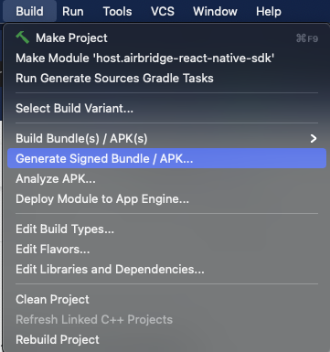

당연히 APK로 빌드하려고 했으나 Google에서는 많은 이유로 **AAB(Android App Bundle)** 파일로 빌드하는 것을 추천하고 있다. 그래서 AAB 파일로 빌드하였다.

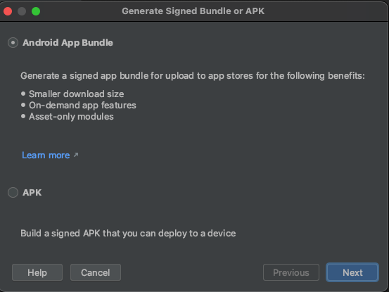

다음 화면으로 넘어가면 처음 빌드라면 빈칸으로 있을 것이다. 우선 `Create new...` 를 클릭해서 Key를 생성한다. 생성한 Key는 잘 보관하길 바란다. Key를 생성하면 생성하면서 입력한 비밀번호를 다시 입력해야한다. 아래와 같이 빈칸을 다 채워주자.

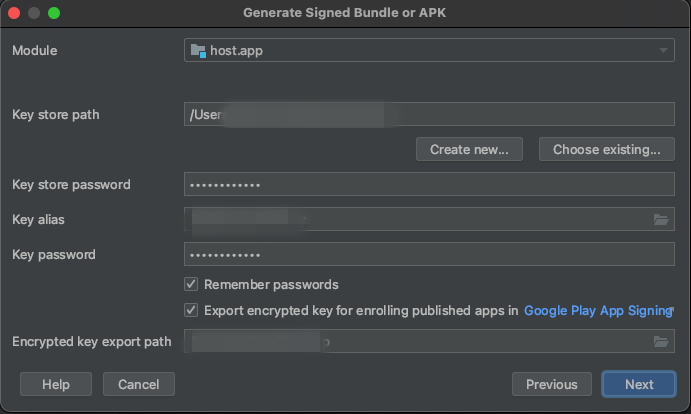

빌드 결과물이 저장될 경로를 설정하고 플레이스토어에 올리기 위해서 **release**를 선택한다.

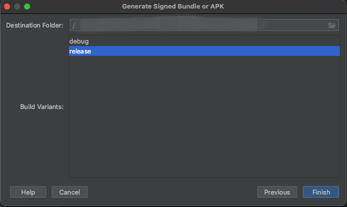

AAB 확장자로 빌드된 파일을 확인할 수 있다.

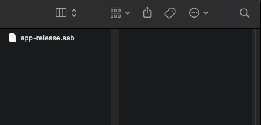

[https://play.google.com/console](https://play.google.com/console) 접속하면 이전에 올려진 버전과 함께 여태까지의 기록을 확인할 수 있다. 앱을 선택해서 자세히보자.

좌측 메뉴 중 프로덕션에 들어가면 우측 상단에 `새 버전 만들기 버튼`이 있다. 우리는 새로운 버전의 앱을 배포하기 위해서 새로운 버전을 우선 만들어 주어야한다.

이전에 국가/지역을 선택해주는 것도 좋다. 모든 국가로도 가능하다. 대한민국만 선택하는 경우 플레이스토어에서 대한민국 기준으로 검색할 경우에만 검색이 되어 모든 국가로 추가해주었다.

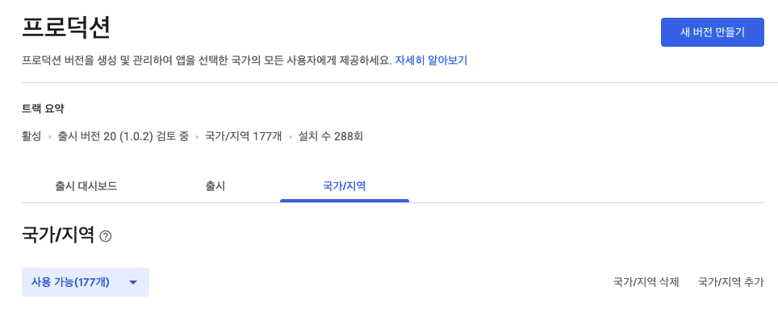

프로덕션 만들기 페이지로 이동하게 되면 중간에 **App Bundle**을 올릴 수 있는 공간이 있다. 드래그해서 올릴 수 있으며 파일을 선택해서 올릴 수 있다(올리는데 약간의 시간이 걸린다).

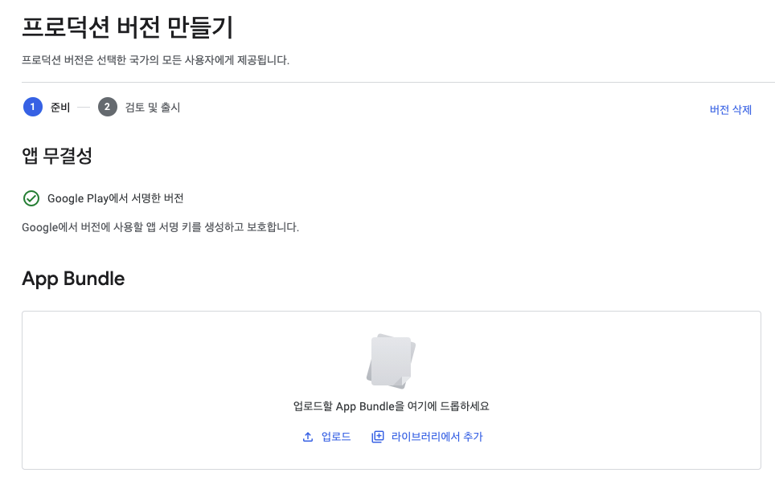

우리가 항상 플레이스토어에서 보이는 개발자들의 변경사항이 출시노트와 동일하다고 생각하면 된다. 사용자를 위해서 간단하게 변경사항 작성하자.

모든 내용을 입력하고 저장을 누르면 `버전 검토 버튼`이 활성화된다. 이어서 `버전 검토 버튼`을 누르자.

이제 `심사가 이루어지고 통과된다면 자동으로 플레이스토어에 올라간다.`

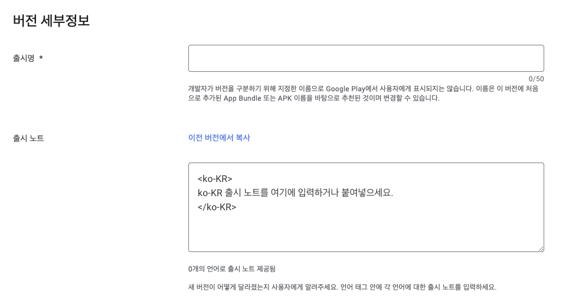

## IOS 앱스토어에 올리기

서명을 이미 Xcode에 등록했다는 가정하에 작성하였습니다. IOS 빌드를 위해 Xcode를 실행한다.

빌드하기 전 빌드할 Bundle의 **version**과 **build version**을 확인한다. 

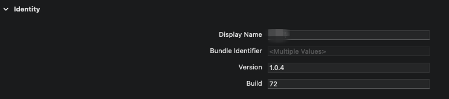

배포 빌드를 위해서는 시뮬레이터를 선택되어 있으면 안된다. 이를 위해 `Any iOS Device`로 바꿔준다.

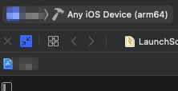

Xcode 메뉴에서 `Product > Archive`를 선택한다. 방금 전 `Any iOS Device`로 선택을 바꾸지 않는다면, 해당 메뉴가 활성화되지 않는다.

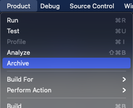

빌드가 되었다면 [appstoreconnect.apple.com](https://appstoreconnect.apple.com) 에 올리는 작업을 하자. 올릴 Bundle 파일을 선택하고 `Distribution App` 버튼을 클릭한다.

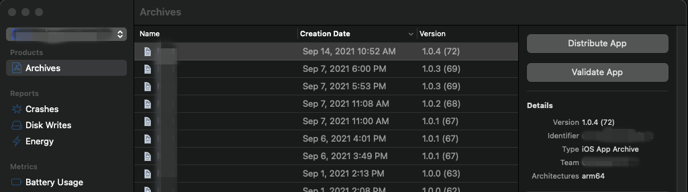

당연하게 앱스토어에 올리는 과정이니 App Store Connect를 선택하고 다음 버튼을 누른다.

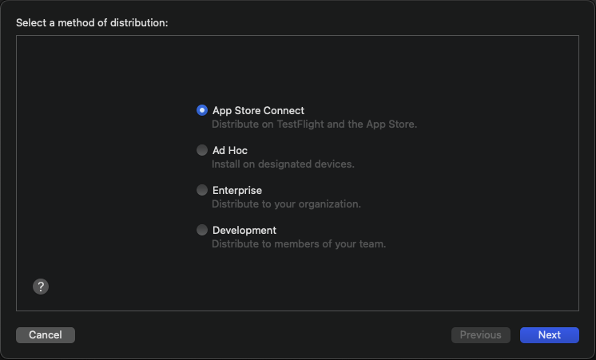

Upload를 선택하고 다음으로 이동한다.

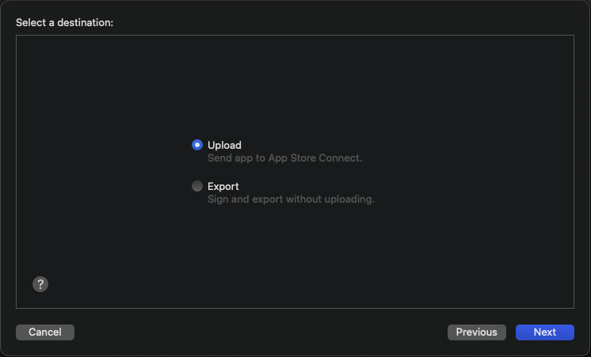

기본으로 설정된 체크박스를 그대로 두고 다음 버튼을 누른다.

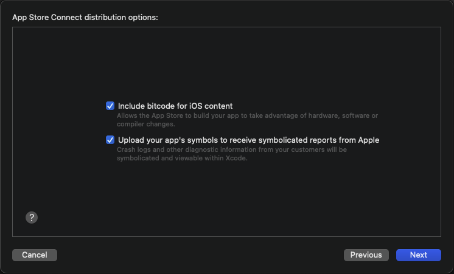

이 단계에서 우리가 가지고 있는 인증서를 선택해서 Bundle 파일에 서명한다.

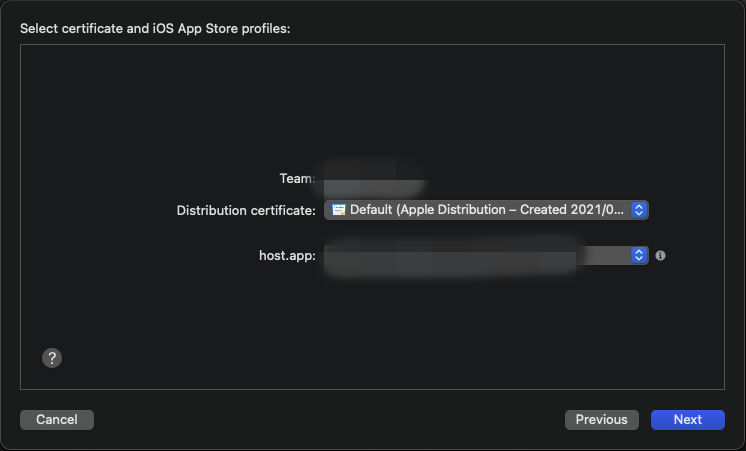

마지막으로 나온 결과값을 확인하고 Upload한다.

upload되면  [appstoreconnect.apple.com](https://appstoreconnect.apple.com) TestFlight 탭에서 확인할 수 있다. 아직은 처리중으로 기다리면 올릴 수 있는 상태로 변경된다.

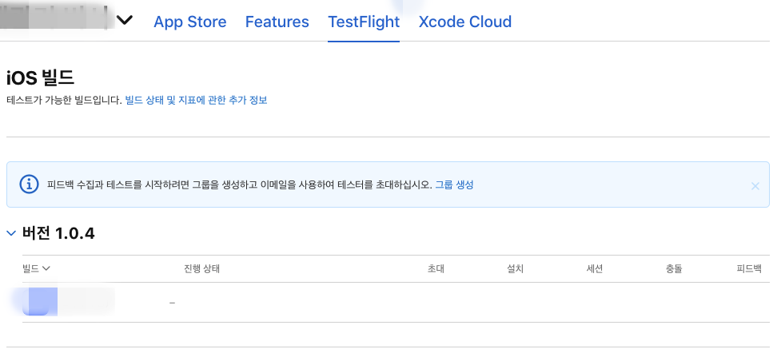

[appstoreconnect.apple.com](https://appstoreconnect.apple.com) 좌측 상단에 있는 플러스 버튼을 클릭해서 새로운 버전을 만든다.

중간을 이동하면 빌드라는 공간에 방금 올린 Bundle파일을 올릴 수 있다.

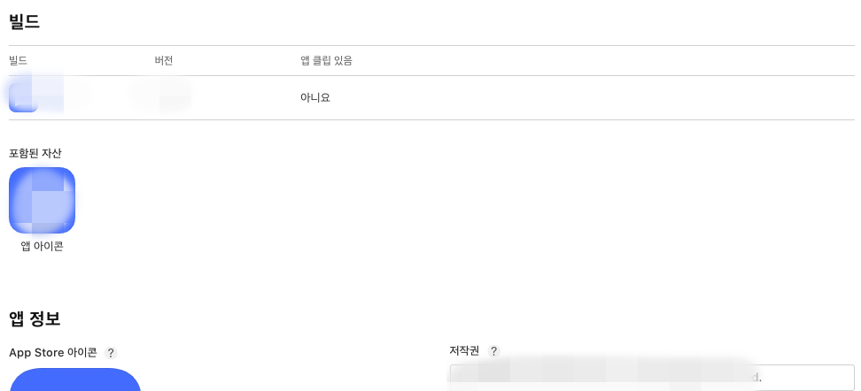

상단에 변경사항을 간단하게 작성(업그레이드된 사항 7자 이상 작성하기)하고 저장을 하고 심사를 위해 제출 버튼을 누르자. 

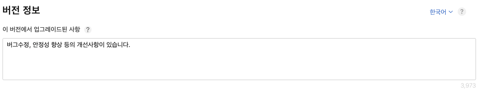

애플에서 심사를 진행하고 승인이 되면 자동으로 플레이스토어에 올라간다. 심사는 최대 일주일이 걸린다고 한다.

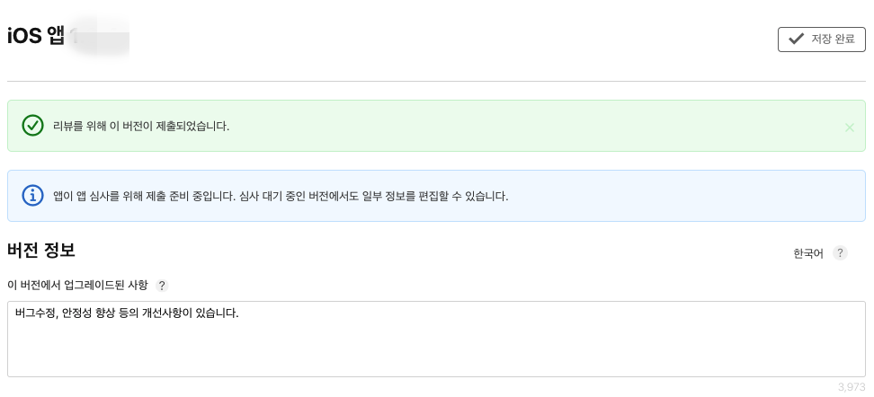

## 👋 Outtro

혼자서 공부를 하고 배포하려니까 많이 힘들어서 작성하였다. 나뿐만 아니라 혼자서 고생하는 많은 분들께 도움되길 바란다.

#### RN 개발기

| | |
|:--:|--|
| IOS Signing(인증서) 제대로 알고 사용하기 | [살짝 읽어보기](/content/2021-08-22--IOS-Signing(인증서)-제대로-알고-사용하기) |
| 앱 개발 유용한 Firebase 기능 | [살짝 읽어보기](/content/2021-08-25--앱-개발에-유용한-Firebase-기능) |
| React Native Webview 개발기 | [살짝 읽어보기](/content/2021-08-29--React-Native-Webview-기능-개발) |
| App과 Web 통신하기 | [준비중]() |
| fastlane으로 간편하게 앱(Android, IOS) 테스트 배포하기 | [준비중]() |
| **PlayStore(플레이스토어) + AppStore(앱스토어) 배포** | [현재 페이지](/content/2021-09-15--PlayStore(플레이스토어)-AppStore(앱스토어)-배포) |

