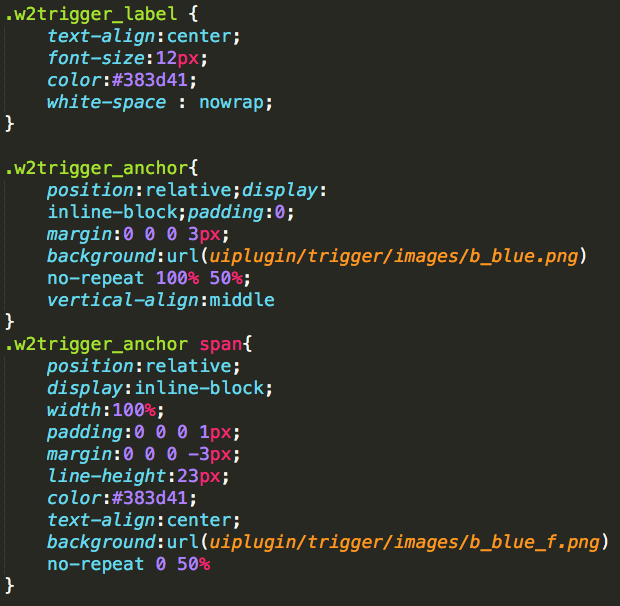

어떤 CSS 방법론을 사용하는지에 따라 프로젝트의 형태와 규칙이 달라진다. 오늘날 많은 방법론 중 **BEM**에 대해서 알아보자.

> CSS 방법론이란 쉽게 유지보수가 가능하게 하고, 재사용할 수 있도록 구현하여, 쉽게 확장 가능하게 하는 공통의 목적을 가지고 있다. 작명 규칙(Naming Convention) 개발, 디버깅, 유지보수를 위하여 CSS 선택자의 이름을 가능한 한 명확하게 만드는 것이 목표이다.

## 기본 규칙 

1. 소문자, 숫자만 사용해서 작명한다.
2. 여러 단어의 조합은 하이픈(-)으로 연결하여 작명한다.

## 블록(Block)

- 재사용할 수 있는 기능적으로 독립적인 페이지 구성 요소, HTML에서 블록은 class 속성으로 표시한다. 
- 형태(red, big)가 아닌 목적(Menu, Button)에 따라서 결정해야 한다.
- 블록은 환경에 영향을 받지 않아야 한다. 즉, 여백이나 위치를 설정하면 안 된다.
- tag, id 선택자를 사용해서는 안 된다.
- 블록은 서로 중첩해서 작성할 수 있다.

```text
예) header, menu, search-form
```

## 요소(Element)

- 블록 안에서 특정 기능을 담당하는 부분: `block__element` 형태로 사용 (더블 언더바)하며, 형태(red, big)가 아닌 목적(item, text, title)에 맞게 결정해야 한다.
- 요소는 중첩해서 작성할 수 있다.
- 요소는 블록의 부분으로만 사용할 수 있고 다른 요소의 부분으로 사용할 수 없다.
- 모든 블록에서 요소는 필수가 아닌 선택적으로 사용한다. 즉 블록 안에 요소가 없을 수도 있다.

```text
예) menu__item, header__title
```

## 수식어(Modifier), 변환자

- 블록이나 요소의 모양(color, size..), 상태(disabled, checked..)를 정의한다. `block__element — modifier`, `block — modifier` 형태로 사용(더블 하이픈)
- 수식어의 Bool 타입과 **키-벨류** 타입이 있다.
  - Bool 타입: 수식어가 있으면 값이 `true` 라고 가정한다. (`form__button — disabled`) 키
  - Value 타입: 키, 벨류를 하이픈으로 연결하여 표시한다. (`color-red`, `theme-ocean`)
- 수식어는 단독으로 사용할 수 없다. 즉 기본 블록과 요소에 추가하여 사용해야 한다.

```html
<div class="header">
  <div class="search-form header__search-form"></div>
</div>
```

> BEM에 대해서 알아보고 직접 구현을 해보면서 느꼈던 점은 다소 복잡한 클래스 명이지만, 실제로 나중에 클래스 명만 보더라도 이게 어떤 용도이고 어떤 형태일지가 그려졌다. 그리고 네이밍은 어려운데, 규칙을 정하고 블록, 요소, 수식어의 목적을 생각하다 보니 조금은 네이밍을 하는데 수월해지고 있다.

---

#### Reference

- [Naming](http://getbem.com/naming/)
